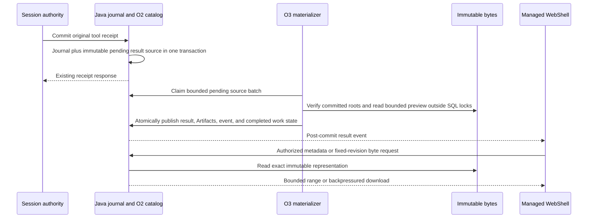

# Managed tool results: public projection and WebShell (O3)

[English](2026-09-29-managed-tool-result-public-projection.md) | [简体中文](2026-09-29-managed-tool-result-public-projection.zh-CN.md)

Status: implementation in this change, disabled by default pending deployment validation. Research date: 2026-09-29; implementation date: 2026-09-30. Part of [#12380](https://github.com/QwenLM/qwen-code/issues/12380).

## 1. Baselines and objective

Research used main at `be1ebc74d7f5b0bdce2b88a6565d4940d5a6b3c0`, O2 [#12894](https://github.com/QwenLM/qwen-code/pull/12894) at `0172d5ecae7a3a11824665800211241d24472cd6`, and the [original result design](https://github.com/doudouOUC/code_agent/blob/689121646cc25ca08a34508a5f5555ae15308833/qwen-code/feature/managed-agents/managed-agent-tool-result-artifacts.md). O2 is an unmerged dependency at this baseline. The implementation is rebased onto main `3b18cfe5e4ab7ea72f1a92736186dacf753bf727` after O2 merged, including its latest retry and cancellation fixes; local tests do not establish real OSS or different-host readiness.

O3 makes a durably recorded tool result discoverable and readable through the Java public API and Managed WebShell. A user can inspect a bounded preview and download an authorized immutable output after the Runtime and Harness have gone. Live events and restored history identify the same result. A successful command, complete capture, committed delivery, and currently readable content remain separate facts.

The first implementation covers Hosted foreground Shell `process_pipes`: stdout and stderr captured through O2. It also projects durable blocked and proven-not-started outcomes. The public resource design leaves room for other content, but enabling local O1 stores, the older same-host SQL publication bridge, Read/Write/Edit content, MCP, PTY, background tasks, or media requires its own verified adapter. Existing metadata-only tool cards continue to work. O3 does not enable public Shell admission, G1/G3 continuation, W1 recovery, task cancellation, or O4 garbage collection.

## 2. What the code actually provides

Paths in this table are relative to the repository; the Ref column identifies the reviewed commit above.

| Ref     | Evidence                                                                                                                                                                                          | Consequence for O3                                                                                                                                                        |
| ------- | ------------------------------------------------------------------------------------------------------------------------------------------------------------------------------------------------- | ------------------------------------------------------------------------------------------------------------------------------------------------------------------------- |
| main    | `packages/sdk-java/managed-agent-server/src/main/java/com/alibaba/qwen/code/managedagent/service/HarnessEventProjector.java:41–59,77–94` only accepts selected event types and tool scalar fields | Expanding an allowlist to arbitrary output would bypass receipt and publication checks.                                                                                   |
| O2      | `packages/cli/src/serve/hosted-harness-session.ts:301–313,358–363` emits journal notifications without a complete public result descriptor                                                        | Harness SSE is a notification source, not proof of accepted content or sufficient backfill.                                                                               |
| O2      | `ToolPublicationAdmissionStore.java:37–129,160–174` installs the outcome/manifest, commits the receipt, and records `REFERENCED` with receipt pointers atomically                                 | Both `committed` and `blocked` outcomes become `REFERENCED`; this phase alone cannot grant downloads.                                                                     |
| O2      | `packages/cli/src/serve/hosted-workspace-tool-turn.ts:860–1000` commits `not_started` through an ordinary inline outcome and journal transaction                                                  | An O3 hook only in publication admission would miss these results.                                                                                                        |
| main/O2 | `ManagedAgentStore.java:344–346,417–419`; `HarnessCoordinator.java:325–327`; O2 `hosted-workspace-tool-turn.ts:569–580`                                                                           | Public `turn_*` and internal prompt UUID differ. Runtime call ID and model call ID also differ.                                                                           |
| O2      | `ToolPublicationDataStore.java:1201–1313` provides exact range validation but requires writer authorization                                                                                       | Browser reads need a narrow persisted-resource reader; a closed Session must not acquire a writer merely to download.                                                     |
| main    | `ManagedAgentService.java:654–685`, `TenantContextFilter.java`, `ManagedWorkspaceRegistry.java`                                                                                                   | Workspace reads check an authenticated actor's grant. A tenant header alone is not sufficient for O3. Existing visible-session logic hides `DELETED`, but not `DELETING`. |
| main    | OpenAPI v1.21.0 reserves Artifact list/content as `planned`; `ManagedAgentService.java:481` advertises `artifacts=false`                                                                          | Result detail, Artifact detail, version/range semantics, and WebShell operations need an explicit contract slice.                                                         |
| main    | `ManagedSessionStore.java:309–313` and `ManagedExtensionRecordStore.java:330–343` already couple journal commits to a durable public projection                                                   | Reuse the transaction and after-commit event infrastructure; a new general outbox dispatcher is unnecessary.                                                              |
| main    | `ManagedAgentWebShell.tsx:32–33`, `managed-agent-provider.ts:82–145`, `ManagedSessionsPage.tsx:459–477`                                                                                           | Managed UI has no daemon workspace context and no Artifact transport.                                                                                                     |
| main    | `ArtifactPanel.tsx:3745–3797` and `artifactUtils.ts:235–328` may assemble an entire daemon file into a Blob                                                                                       | Reuse visual primitives, not the daemon file reader or its download path.                                                                                                 |

The Java store paths above are under `packages/sdk-java/managed-agent-server/src/main/java/com/alibaba/qwen/code/managedagent/`; the UI paths are under `packages/web-shell/client/`. These are observations, not new behavior.

## 3. Result states and the first supported representation

| Durable evidence                                                              | Public result                                                                       | Downloadable Artifact                                                  |
| ----------------------------------------------------------------------------- | ----------------------------------------------------------------------------------- | ---------------------------------------------------------------------- |
| O2 receipt decision `committed`, capture `complete`, validated sealed streams | Preserve execution `success`, `error`, or `cancelled`; delivery `committed`         | One per approved stdout/stderr stream, including zero-byte streams.    |
| O2 receipt decision `blocked`, capture `partial` or `unavailable`             | Preserve the physical execution outcome, capture reason, and delivery `blocked`     | None in the first slice; diagnostic bytes remain private and retained. |
| Ordinary receipt plus matching O2 catalog `NOT_STARTED`                       | Execution `not_started`, capture `null`, delivery `blocked`; UI says “not executed” | None. This outcome does not imply an indefinitely blocked Turn.        |
| Publication `FINISHED` without a journal receipt                              | No accepted result is inferred                                                      | None.                                                                  |
| Rejected or malformed publication without a receipt                           | Preserve only independently established tool state                                  | None; never fabricate a terminal result.                               |

A receipt proves that the decision was recorded. It does not make a `blocked` decision committed delivery. An Artifact's later storage availability is separate from historical capture completeness: missing or quarantined bytes cannot rewrite a successful execution or trigger it again.

The first downloadable representation is an exact sealed stream from an approved O2 manifest. Each stream has its own length and SHA-256. stdout and stderr are separate; concatenation would invent ordering and a new representation. Raw bytes may be non-UTF-8. Public previews are independently approved text and never substitute for the bytes consumed by the model or Hooks.

## 4. Durable projection, without a second execution authority

### 4.1 Source capture

Add a SQL-only hook at the common `ManagedSessionStore.commit` receipt path. It records an immutable source in the same transaction as each `tool.receipt`. Preserve the complete Session key, journal transaction/revision/sequence, `executionCallId`, exact outcome/result/resource references, and a canonical source digest. Replayed identical transactions reuse the source. A changed source under the same identity is a conflict, not an overwrite.

Use `managed_agent_tool_result` for both pending work and eventual public metadata. Do not add a general task queue or depend on Stage H outbox dispatch. The hook does not read OSS, generate previews, request authorization from a remote service, lock the public Session row, or emit public content. Its bounded insert is part of receipt durability; a database failure can fail that transaction, while later projection failures cannot undo an accepted receipt.

Capture sources even while public O3 capability is disabled. Unsupported receipt producers are explicitly marked unsupported by the materializer; they never gain an Artifact merely because they contain a reference. An internal Session with no public Session mapping remains private.

### 4.2 Verification and identity mapping

The materializer claims bounded work with a database lease and fencing token. In the first slice it validates:

1. The original journal receipt and exact outcome digest, plus the full tenant/Workspace/Session scope.
2. For a started capture, the O2 publication binding, frozen root, `REFERENCED` state, receipt sequence/revision, manifest identity, descriptor order, closure, and admission decision. For `not_started`, the original `NOT_STARTED` binding and ordinary inline outcome. A catalog phase is never sufficient by itself.
3. The unique public Turn selected by `(tenantId, sessionId, prompt_id)` where `prompt_id` is the binding's internal `turnId`. Check the persisted Session Workspace. Never use the active or latest Turn.
4. The original `modelCallId` for matching the tool card, and `executionCallId` for the result source. Do not substitute the Runtime call ID.
5. The trusted publication policy and its version before producing any public preview or original-byte mapping.

Use the same Java item-ID helper as existing tool projection: public Turn ID plus model call ID. O3 must create a settled tool Item when no earlier tool event produced one. This matters because current Hosted journal events may not produce public tool cards. Live result display means publication after the durable receipt; streaming output before that receipt is outside this slice.

All object I/O happens outside SQL transactions. The final short transaction locks the public Session and then the result row, verifies the claim/source/policy version, and checks that the Session is neither `DELETING` nor `DELETED`. Recheck the frozen root, receipt pointer, and current catalog quarantine/representation state in SQL: a concurrent quarantine must not become an available download mapping. It commits public metadata, Artifact mappings, the `item.tool_result.updated` event, and work completion together. Publish SSE only after commit using the existing event publisher. No active Turn, Harness process, or dispatch lease is required.

If content is quarantined before projection, verified receipt metadata still projects without Artifact mappings or shared previews. Quarantine during the final commit retries the projection so that the next attempt publishes metadata only. Invalid metadata identity or digests remain terminal failures.

### 4.3 Minimal persisted data

These are logical tables and fields, not reserved migration numbers:

| Record                      | Required data and constraints                                                                                                                                                                                                                                                                                                                    |
| --------------------------- | ------------------------------------------------------------------------------------------------------------------------------------------------------------------------------------------------------------------------------------------------------------------------------------------------------------------------------------------------ |
| `managed_agent_tool_result` | Unique full Session scope plus original receipt execution identity; immutable receipt references and digest; resolved publication/binding identity; public Turn and Item IDs; projection schema/version; bounded approved descriptor; pending/ready/retryable/unsupported/quarantined/suppressed work state; bounded retry time and claim fence. |
| `managed_agent_artifact`    | Unique `(result_id, stream_id)`; Artifact ID includes manifest revision and representation policy version; opaque public ID; original-byte representation length/digest; private root mapping; source receipt reference; public availability; creation sequence. No raw output body.                                                             |

The current migration enforces one Artifact per `(result_id, stream_id)`. Artifact IDs also include the manifest revision and policy version. A separately reviewed reprojection requires a migration that widens this unique key before a second representation can be stored.

Generate stable opaque result/Artifact IDs using SHA-256 over a versioned, length-prefixed encoding of the complete scoped source identity and representation identity. Store and test the encoding with golden fixtures; do not hash ambiguous string concatenations or arbitrary JSON order. IDs are discoverable identifiers, never credentials. Rebuilding from retained source facts must reproduce the same IDs.

No third reference table is needed for this slice: each Artifact row is a public reference edge to its retained source. O4 must later account for this edge and pending projection sources before enabling deletion.

### 4.4 Retry, backfill, and ordering

The result row's completed state is the permanent duplicate guard. Event `source_key` deduplication alone is insufficient once events can expire. Use a stable source key containing result identity and projection version. A lost commit response or expired materializer claim must not produce another Artifact or public event.

Transient storage failures retain pending work with bounded backoff. Invalid source identity or digest is quarantined and observable, not retried in a hot loop. Repeatedly failing sources do not starve later work. The materializer has finite batch and concurrency limits, and claims are reclaimable after a crash.

Deployment validation must measure pending age, receipt-to-publication latency, retry/quarantine counts, read amplification, active readers, and peak memory. The implementation stores work state, attempts, failure codes and receipt positions, and logs scoped read byte counts; it does not add a metrics exporter. Record scoped IDs and bounded reason codes, never output bodies or credentials. These measurements determine deployment limits and expose stalled projection without making UI polling an execution trigger.

For historical receipts, scan each retained journal with a fixed captured high watermark and bounded pages, inserting the same source identity. Resume per Session, not by a global timestamp that can skip a concurrent transaction. A compatibility scan includes ordinary `not_started` receipts; scanning only `REFERENCED` publications is incomplete. New receipt capture runs before backfill starts. Missing original bindings/resources block that source instead of guessing a mapping.

Persist the backfill high watermark and last scanned private journal revision in a small per-Session checkpoint, advancing at most 50 journal transactions per tick. Each transaction commits its source inserts and checkpoint advancement together, so an invalid later record preserves earlier progress. This is scan progress, not a third resource-reference table. Never reuse the public Snapshot's `covered_sequence` for this cursor.

Results can become public after `turn.completed`. Reducers apply the result to the settled Item without restarting the Turn or adding another terminal event. Consumers can accept later revisions, but this slice does not produce a second projection. Receipt sequence, public event sequence, manifest revision, and projection revision are distinct counters.

### Review follow-up: implemented queue and read boundaries

Current receipts are parsed once with the extension records and captured with a batched source lookup/insert inside the journal transaction, including while public projection is disabled. New journal heads start with historical backfill complete. Heads that predate O3 enter an indexed pending queue; each journal transaction atomically advances its fixed watermark checkpoint and clears the pending marker when drained or quarantined. Claim selection reads one indexed eligible head for each of PENDING, RETRYABLE, and expired LEASED, rather than sorting the entire eligible backlog. A lapsed current claim enters bounded retry backoff; a superseded generation cannot modify its replacement.

Projection runs on a dedicated single-thread scheduler, while existing Harness, lifecycle, and message schedules retain the default scheduler. A READY source is not reclaimed: this implementation emits projection_revision 1 exactly once. Replay consumers retain monotonic revision guards for duplicate/stale events; supporting a second policy projection requires the separately reviewed representation migration above. Public delivery pending is reserved; accepted receipts currently publish committed or blocked. Missing public Turn mapping has its own unsupported diagnostic.

Metadata evaluates the current raw-read policy once per request and batches publication availability checks per Session scope. Content requests retain fresh authorization and catalog checks at every chunk boundary. An initial guard and range bounds run before metadata closure reads. Fixed-revision reads still verify the complete immutable metadata closure; reducing closure verification or throttling current grants is not part of this change. Audit records distinguish denied, rejected, interrupted, and completed reads, including completed zero-byte streams. (Superseded 2026-10-02 by issue #13181: the per-chunk access re-check is windowed by `qwen.managed-agent.artifacts.read-revalidation-interval`, default 5s; the read lease's durability checks still run per chunk. See [Managed Agent Query Amplification Fix](2026-10-02-managed-agent-query-amplification.md) §7.)

The preview source window is up to 8 KiB, with independent UTF-8 byte and 200-line limits. Automatic previews reuse each artifact's verified metadata handle and are omitted when verifying the intersecting segments would read more than 1 MiB. Artifact metadata and requested content remain available. WebShell retains four pages including lookback bytes, keeps an output panel mounted across a same-Session refresh, and settles assistant text before a new result row in the current Turn. Transient 429/503 content reads retry the identical request once after Retry-After (a maximum five-second wait; a longer Retry-After is returned as an error without an early retry); cancellation also aborts that wait. Java-produced contract fixtures are compared on every normal test run, normalizing only timestamps and randomly assigned event IDs.

## 5. Public contract and event recovery

The canonical OpenAPI remains the source for Java contract tests and generated WebShell types. This change implements the seven routes below with handlers and conformance tests in OpenAPI v1.27.0, plus Flyway V26 after rebasing onto main and reconciling the merged O2 migrations and concurrent contract work such as [#12998](https://github.com/QwenLM/qwen-code/pull/12998).

| Surface        | Operation                                                                                                         |
| -------------- | ----------------------------------------------------------------------------------------------------------------- |
| Public REST    | `GET /v1/agents/sessions/{sessionId}/items/{itemId}/tool-result`                                                  |
| Public REST    | `GET /v1/agents/sessions/{sessionId}/artifacts`                                                                   |
| Public REST    | `GET /v1/agents/sessions/{sessionId}/artifacts/{artifactId}`                                                      |
| Public REST    | `GET /v1/agents/sessions/{sessionId}/artifacts/{artifactId}/content?revision=...`                                 |
| WebShell JSON  | `POST /api/agent/web-shell/v1/tool-results/get`, `artifacts/query`, and `artifacts/get`                           |
| WebShell bytes | Use the same authenticated public GET through the Managed provider's transport; do not wrap bytes in JSON/base64. |

These are persisted-Session resource routes on the Java control plane. They are neither process-global nor daemon primary/selected-runtime/live-owner routes. No lookup may fall back to a local path, active Runtime, or primary Workspace.

The public result descriptor contains `id`, public `session_id`/`turn_id`/`item_id`, `projection_revision`, execution/capture/delivery states, bounded reason codes, `capture_scope`, `upstream_truncated`, approved preview text with source coverage and truncation flags, and approved Artifact references. `capture_status` and capture scope are nullable for `not_started`. Keep `pending/committed/blocked` as the delivery vocabulary. O3 has no `rejected` delivery state.

Artifact metadata contains opaque ID, fixed revision, stream role, authorized media type, byte length, SHA-256, availability, and creation identity. Content links are derived from Java routes. Never expose object keys, bucket/Runtime URLs, local paths, `DurableRef`, private model messages, writer credentials, or publication grants. Public preview approval does not grant original-byte access.

Artifact list pagination fixes a creation-sequence watermark on the first page, then uses a scope-bound cursor containing that watermark and last returned immutable creation identity. Recheck current access on every page. New artifacts after the watermark appear in the next traversal. Store/validate cursor version and Session scope; reject malformed or cross-Session cursors. Use `limit` 1–100, query `limit + 1`, and return an explicit `has_more`/next cursor. Availability and authorization remain current, so this is stable membership, not a frozen permission snapshot.

`item.tool_result.updated` carries the same approved descriptor used by result detail and Item materialization, within a 16 KiB encoded event budget. Persist `itemId`, public Turn ID, Artifact IDs, and fixed revisions. Update `EventIdentity`, the event envelope, Item materializer, and the transcript control-event exclusion so covered result events do not reappear as old control events. Snapshot contents and watermark must commit together; do not mutate an old snapshot in place after its watermark.

Live and Snapshot adapters use one normalization rule. They prefer canonical `itemId`, preserve pending versus running versus settled, and retain cancellation distinctly. Replayed or older projection revisions do not regress the card. Snapshot-plus-tail and `stream_gap` recovery continue through the existing Managed session hook. Artifact list is independently queryable when a client missed the announcing event.

`capabilities.artifacts` means these reads are supported for the authenticated Managed Session; it does not promise that a result exists or enable tool execution. Add the corresponding WebShell capability. Populate both from the actual configured O3 service and supported Session scope, with false for unsupported profiles. A UI method's presence alone cannot enable the feature.

The shared descriptor contains resource facts, never actor-specific `canDownload` or `canReadContent`. Result/Artifact metadata responses add a separate current-actor access overlay. The UI combines that overlay, representation availability, and host transport support to select actions; events and Snapshots contain no access overlay. Fetch current access when opening or downloading, and still authorize every content request. The overlay is a UI hint, not a credential.

## 6. Publication and authorization

O3 requires a trusted tenant/actor principal for every operation, followed by current Session/Workspace read authorization and representation authorization. A bare `X-Qwen-Tenant-Id` is not identity proof. Restrict the first slice to Workspace-bound Managed Sessions; do not inherit the looser unbound read behavior. `DELETING` and `DELETED` both hide O3 resources. Closed or archived Sessions remain readable while current grants permit it.

Use one narrow product-supplied artifact access policy, wired alongside the existing trusted identity integration. It decides whether an original representation may be published and whether the current actor may read its bytes. Missing policy denies original-byte publication/read. The first release must include a concrete integration and tests that populate this decision, not a declared option with no production caller. This does not require a new generic role service or public grant-management API.

The default `ManagedArtifactPolicy` is wired to deployment configuration. `qwen.managed-agent.artifacts.enabled=true` enables metadata projection and reads when O2 storage is configured. `publish-original=true` separately approves original representations for current Workspace readers, and `publish-preview=true` additionally approves shared previews for that same audience. Both publication flags default to false. A product with narrower rules supplies its own policy bean; the server still checks current Workspace grants on every read. This is an explicit deployment-wide approval, not a per-user role inferred from a request header.

The policy version and approved representation are frozen when a result first reaches `READY`. Changing flags does not automatically republish historical metadata-only results or remove already published previews from durable events. Raw read permission is evaluated with the current policy on every request. A future policy migration needs an explicit, separately reviewed reprojection operation; toggling a flag is not such an operation.

Preview policy is separate and versioned. A preview stored in shared Session events must be approved for **every authorized Session reader**, because replay is not actor-specific. Do not insert an actor-private preview into the common event stream. Default to metadata-only if that audience cannot be established. Bounded text, ANSI removal, or a secret regex alone is not a confidentiality guarantee. Preview generation never copies raw invocation arguments or the private model message automatically.

Unknown or unreadable resources use the product's 404 policy. A caller allowed to discover an Artifact but forbidden to read its original bytes receives `403 artifact_content_forbidden`. Only an authorized caller may observe an expired-version `410`. O3 does not expire retained representations; `410` is reserved for a future retention implementation, while current missing/quarantined content is unavailable. Authorization runs before range/precondition errors disclose length or version. Audit actor, scoped IDs, decision, and byte count; do not log content, credentials, or signed links.

Check access and current catalog/representation availability on request admission, before the first byte, and at bounded stream chunk boundaries. Revocation/deletion or quarantine stops subsequent chunks; bytes already delivered cannot be retracted. The transport aborts cleanly on client disconnect and releases its concurrency slot. Public metadata and byte responses use `Cache-Control: private, no-store`. (Superseded 2026-10-02 by issue #13181: the in-stream access re-check runs at most once per `read-revalidation-interval`, default 5s — revocation/deletion lands at the first chunk boundary after the window's end; the per-chunk lease checks are unchanged. See [Managed Agent Query Amplification Fix](2026-10-02-managed-agent-query-amplification.md) §7.)

## 7. Exact bytes, HTTP, and bounded downloads

Introduce a package-internal committed-source reader. Its input is a server-resolved result/Artifact identity and fixed representation, not caller-supplied refs or expected identity. It verifies the original receipt/catalog mapping and reuses O2's immutable object validation. It neither acquires nor renews a Session writer and works after writer seal or Runtime removal. Existing owner-authenticated private routes retain their meaning.

For a complete download, validate the frozen manifest/page mapping once, then read and verify touched segments sequentially with backpressure. Full HTTP/1.1 downloads close their connection so an abort after committed headers reaches the client promptly; bounded range responses retain normal connection reuse. Verify each complete segment before emitting any bytes from it; a later segment failure aborts the remaining download. O2 currently reads and hashes an entire touched segment, whose maximum is 16 MiB. A 1 MiB public range therefore does not imply a 1 MiB server working set. Bound segment buffers and concurrent readers; do not repeatedly rescan the entire closure for each small download chunk or aggregate the whole stream.

| Request or condition                                                     | Proposed behavior                                                                                                             |
| ------------------------------------------------------------------------ | ----------------------------------------------------------------------------------------------------------------------------- |
| Fixed revision, no `Range`                                               | `200`, exact original bytes, explicit length, backpressured full download. Empty stream is a valid zero-byte response.        |
| One valid satisfiable byte range                                         | Normalize closed/open/suffix form, cap at EOF; `206` with exact `Content-Range` and returned length.                          |
| Valid range with no intersection, including any range on an empty stream | `416` with `Content-Range: bytes */<length>`.                                                                                 |
| Malformed/multiple ranges                                                | `400 invalid_range` / `unsupported_range`; no multipart or full-body fallback.                                                |
| Normalized range exceeds the configured public cap                       | `400 range_too_large`, with the supported cap; no silent truncation/full response.                                            |
| Supplied strong `If-Match` does not match the selected revision          | `412`, before bytes. UI fetch/range requests supply the validator obtained with metadata.                                     |
| `If-Range`                                                               | Follow HTTP semantics; a mismatch selects the full-download path and its separate budget. UI uses `If-Match`, not `If-Range`. |
| Unknown revision / known expired revision                                | Authorized `404` / `410`; never silently serve latest.                                                                        |
| Concurrency budget exhausted / storage temporarily unavailable           | `429` with retry guidance / `503`; never rerun the tool.                                                                      |
| Integrity failure or disconnect after headers                            | Abort the stream; never append a JSON error to bytes or report a complete download.                                           |

Use an immutable strong ETag derived from the selected representation digest. Disable transparent compression/transformation so offsets describe stored bytes. Return `Content-Disposition: attachment`, a server-generated safe filename, `application/octet-stream`, `X-Content-Type-Options: nosniff`, and `Accept-Ranges: bytes`. The metadata's media type guides the safe UI preview. Replace the currently planned legacy `Digest` header with `Repr-Digest` for the full representation; a bounded range may additionally carry `Content-Digest` for that response body. Do not label the full digest as the range body's digest. These choices follow [RFC 9110](https://www.rfc-editor.org/rfc/rfc9110.html#section-14) and [RFC 9530](https://www.rfc-editor.org/rfc/rfc9530.html#section-3).

Implemented starting limits are an 8 KiB/200-line total preview, a 16 KiB public result event, 64 KiB UI text pages, a 1 MiB public range cap, and a four-page/256 KiB raw UI cache. These are O3 limits, separate from O2 capture quotas. The default read concurrency is four; each admitted read has a two-minute elapsed-time budget checked at chunk boundaries, in addition to storage-client timeouts. Enforce encoded UTF-8/JSON size rather than JavaScript character count. Deployment read concurrency, timeouts, and throughput limits require measured values before enablement.

### Browser download integration

The current Java client supports dynamic `getHeaders`, custom `fetch`, and `credentials`. A bare link drops custom authentication/tenant headers; `response.blob()` accumulates the whole file. Neither is the default O3 implementation.

Expose an explicit Managed-provider `downloadArtifact` operation backed by a host streaming-save callback. The bundled implementation can use a supported browser writable-file stream with authenticated fetch; a same-origin gateway that derives tenant/actor from its session can use native streaming download. Every content request requires the immutable revision. Fetch-based reads also send `If-Match`; native browser downloads cannot attach that header and rely on the exact revision mapping, never a latest-version redirect. Check the available transport before offering the action. Header-only hosts without a streaming sink expose bounded preview/range reads and no download action until they supply one. Do not put Bearer credentials in a URL or silently allocate a large Blob. Download transport support is a UI rollout gate; raw REST streaming can still be tested independently. A Java download-ticket protocol would be a separate, reviewed expansion if universal native browser download is required.

## 8. Managed WebShell changes

Extend `ManagedAgentProvider` and `JavaManagedAgentClient` with result get, Artifact list/get, fixed-revision range read, and the explicit download operation. All use the same injected authentication transport and `AbortSignal`. Generate WebShell DTOs from the canonical OpenAPI; do not hand-edit generated files or activate planned routes in the generator.

Reuse `MessageList`, `ToolGroup`, safe text/ANSI rendering, and the shared UI primitives. Pass one result-open callback through the message components to a Managed-specific output panel owned by `ManagedSessionsPage`. Do not coerce a result into `DaemonSessionArtifact`, invent a Workspace path, or call daemon file/stat routes. Update tool memo comparisons so a descriptor/revision change rerenders even when `rawOutput` is unchanged.

The card presents execution, capture, and delivery separately. A failed command can offer complete stderr; a successful command with blocked capture cannot claim complete output. Pending projection is not a failed execution. `not_started` has no capture. Cancellation sets the existing cancellation presentation, not just the generic failed flag.

The panel has separate stdout/stderr tabs, current byte range and total size, bounded pages, and an explicit download action when supported. Keep at most four 64 KiB raw pages in the initial implementation; rendering and decoded text must remain bounded too. Decode adjacent UTF-8 chunks incrementally. A random byte jump needs boundary handling; replacement characters never alter download bytes. Keep escape sequences inert. Do not auto-render HTML/SVG or fetch external URLs. Full-output search and live unsealed tailing are deferred.

Opening a result pins its revision. A `412` requires explicit refresh; a `410` shows expiry, and unavailable content remains visible as metadata. Session/provider/product identity changes and panel closure abort outstanding reads and clear caches. A response from an old request cannot update the new Session. Use scoped portal roots and React 18-compatible refs for any new dialog.

## 9. Retention and failure boundaries

O3 adds public reference mappings and read admission; O4 owns physical garbage collection. Retain source receipts, binding identities, outcomes, manifests, pages, and segments while pending/ready results depend on them. O2 currently retains used/uncertain content without automatic GC. O3 must not introduce a TTL cleanup that defeats this guarantee. A future O4 implementation must honor public references, projection backfill windows, and in-flight read holds before enabling deletion.

| Failure                                                                                       | Required result                                                                                                                                                                      |
| --------------------------------------------------------------------------------------------- | ------------------------------------------------------------------------------------------------------------------------------------------------------------------------------------ |
| Receipt commits, process dies before projection                                               | Pending row is durable; a replacement materializer publishes the original source.                                                                                                    |
| Object I/O succeeds, public projection transaction fails                                      | Retry identical source; no public event or partial Artifact membership escapes the failed transaction.                                                                               |
| Projection commits, response/SSE is lost                                                      | Result/list/Snapshot recovery returns the same IDs and revisions.                                                                                                                    |
| Turn completed before projection                                                              | Late result updates its settled Item; no new Turn or model continuation.                                                                                                             |
| Session deletion races projection                                                             | Session-row gate prevents public writes after deletion starts; source is retained/suppressed for recovery policy.                                                                    |
| Access revoked during a range/download                                                        | Stop future delivery at the stated chunk boundary; no Runtime action. (Since 2026-10-02, issue #13181: at the first chunk boundary after the revalidation window's end, default 5s.) |
| Accepted bytes become corrupt or missing                                                      | Availability becomes unavailable with bounded diagnostics; original execution/capture facts are preserved.                                                                           |
| An uncertain publication candidate's operation deadline expires before durable finish/receipt | No public accepted Artifact; [#13019](https://github.com/QwenLM/qwen-code/issues/13019) owns that liveness policy. This is not expiry of retained publication data.                  |

O3 cannot certify O2 durability, solve orphan Runtime cleanup, or make partial output safe for model continuation. Its reads remain independent of those execution recovery actions.

## 10. Implementation slices and consumers

The default delivery is **one complete O3 feature PR**. O3a–O3e below are work areas and acceptance gates, not five sequential PRs. Agree on the result contract first, then develop backend and UI against it concurrently. Add tests with each behavior; the final packaged-stack run verifies their integration. Persisted source capture precedes historical backfill, and public enablement follows successful end-to-end verification.

For the foreground Shell scope and reuse of O2 storage/validation, the planning estimate is 2,000–3,000 lines of handwritten production code, or roughly 4,000–6,500 lines including tests, contract/migration changes, and generated types, excluding this design pair. This estimates new and materially changed code, not a measured final Git net addition. Reassess if O2's final interfaces or the required browser download integration change.

| Slice                                | Deliverable                                                                                                       | Exit gate                                                                                                                                 |
| ------------------------------------ | ----------------------------------------------------------------------------------------------------------------- | ----------------------------------------------------------------------------------------------------------------------------------------- |
| O3a: contract and publication policy | Implemented public/WebShell schemas, status matrix, identity mapping, policy integration and fixtures             | Shared fixtures distinguish prompt/public Turn, model/Runtime call IDs, blocked/not-started, and approved preview versus raw access.      |
| O3b: durable public projection       | Receipt source hook, result/Artifact tables, bounded materializer/backfill, public event and Snapshot integration | Crash/replay/deletion tests show one result and stable IDs, including late results and not-started receipts.                              |
| O3c: metadata and content reads      | Public/BFF metadata, scope-bound pagination, committed-source reader, range/streaming, authorization              | Closed-owner reads, cross-scope refusals, exact bytes and bounded slow-reader memory pass.                                                |
| O3d: Managed WebShell                | Provider/client, generated types, card state, bounded panel and host download integration                         | Real Java payloads render identically live/restored; supported auth modes retain credentials; unsupported download transport is explicit. |
| O3e: release validation              | Packaged-stack fault matrix, real SQL/OSS reads, browser large-output checks, deployment limits                   | All enabled behavior has success and refusal evidence; public Shell/other producer gates stay separately owned.                           |

O3a can proceed against the pinned contracts. Merge/runtime validation of O3b–O3e depends on the final O2 data and receipt interfaces. Coordinate ordinary task Artifact references with H3, but do not require H1–H6 or a general outbox to finish first. This is cross-package infrastructure feature work and requires maintainer review under the repository gate.

| Area                       | Direct consumers to review                                                                                                                                                    |
| -------------------------- | ----------------------------------------------------------------------------------------------------------------------------------------------------------------------------- |
| Java journal and O2 stores | `ManagedSessionStore`, publication admission/data stores, ordinary inline receipts, O2 writer fencing and replay tests.                                                       |
| Java public persistence    | `AgentStateStore`/`ManagedAgentStore`, `EventIdentity`, committed event publisher, message materializer, deletion/lifecycle, Item/Snapshot/event replay.                      |
| Java API and auth          | Public/WebShell controllers, `ApiModels`, tenant actor filter, Workspace read grants, artifact policy, error mapping and OpenAPI contract tests.                              |
| WebShell API layer         | Canonical OpenAPI, generator, generated types, Java client/provider, provider interface and capability consumers.                                                             |
| WebShell presentation      | Event/Snapshot projector, Managed message reducer/session hook/page, MessageList/MessageItem/ToolGroup memo path, Shell output, new Managed panel and host download callback. |
| Boundary regressions       | Legacy daemon artifacts, O1 local capture, O2 private readers and ACK, Hosted no-tool/file profiles, task lists with no Artifact producer.                                    |

No change to Tool v3 execution/ACK schemas or Broker dispatch is required by this design. Any newly discovered need to change those boundaries requires revisiting the slice scope.

## 11. Validation plan and acceptance

The companion working plan is `.qwen/e2e-tests/2026-09-29-o3-public-projection.md`. Each behavioral test must exercise the actual producer or transaction boundary; mocked UI data alone cannot prove the pipeline.

| Group                  | Required evidence                                                                                                                                                                                                  |
| ---------------------- | ------------------------------------------------------------------------------------------------------------------------------------------------------------------------------------------------------------------ |
| Source and identity    | committed, blocked and not-started; reused model call ID across Turns; differing Runtime/model IDs; wrong tenant/Workspace/Session; forged or changed digest; missing public Turn mapping; unsupported producer.   |
| Publication/recovery   | crash after receipt, before/after public commit, after claim expiry; two materializers; event pruning/replay; bounded backfill concurrent with new receipts; no duplicated side effect, result or Artifact.        |
| States                 | success/error/cancelled with complete capture; success with blocked partial capture; not-started with null capture; FINISHED without receipt; quarantined content without rewriting execution.                     |
| API and authorization  | current actor/read/raw grants; tenant-header-only rejection; cross-Session ID/cursor, deletion/revocation races, closed/archived reads; 400/403/404/410/412/416/429/503 precedence.                                |
| Bytes                  | empty/binary/NUL/invalid UTF-8, split UTF-8 and segment boundaries; 100 MiB/1 GiB exact streaming digest and tail; slow readers and cancellation; bounded server/browser RSS and metadata read amplification.      |
| UI                     | Java-produced event and Snapshot fixtures; duplicate/old/late result revisions; stream gap and reload; cancellation; descriptor-only memo update; four-page cache; panel/session switch abort; no daemon requests. |
| Contract/compatibility | planned routes excluded until served; generated client parity; existing Legacy artifacts and Managed no-tool/file behavior; no new tool execution caused by read/refresh/retry.                                    |

Use distinct SQL databases, object prefixes, Session keys, and work directories. A deterministic local model is sufficient to establish O3 result plumbing; the first public Shell admission need not be enabled for a private O2 test producer to feed genuine public O3 reads. MySQL/MariaDB, real private OSS and browser transport evidence must be named separately from H2/mock evidence. A global CLI version/help check only identifies the baseline binary; it does not test the Java public API.

Acceptance requires that all published references remain discoverable after reconnect and Runtime removal, that downloads reproduce the exact approved representation, that unapproved bytes never enter events or reads, and that memory stays bounded at fixed concurrency as output grows. The implementation tests distinguish H2 plus an in-memory object store, real MySQL, and browser evidence. Real private OSS and production slow-reader load validation remain deployment gates; the local fixture results do not establish them.

## 12. Deployment decisions

1. Which product policy approves a shared preview and which current actors may download original bytes? Recommended default: metadata-only until an explicit trusted adapter grants each representation.
2. Which host supplies the authenticated streaming-save path? Recommended first delivery: the existing product gateway or an explicit host callback; universal browser tickets are a separate feature.
3. Confirm the first producer boundary: O2 foreground Shell only, with blocked outcomes shown but partial bytes private. Add other producers only after their receipt/retention adapters pass the same gates.
4. Choose measured download concurrency, throughput and timeout limits, and approve the proposed preview/range/cache bounds. These do not alter O2 capture quotas or deadlines.

These decisions gate public enablement. The implementation ships with O3 disabled and preserves O2's immutable facts; enabling the reader does not enable a new execution producer.
