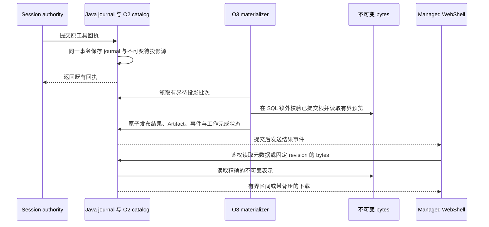

# Managed 工具结果：公开投影与 WebShell（O3）

[English](2026-09-29-managed-tool-result-public-projection.md) | [简体中文](2026-09-29-managed-tool-result-public-projection.zh-CN.md)

状态：本次改动包含实现，默认关闭，开放前须完成部署验证。调研日期：2026-09-29；实现日期：2026-09-30。属于 [#12380](https://github.com/QwenLM/qwen-code/issues/12380)。

## 1. 基线与目标

调研使用 main 的 `be1ebc74d7f5b0bdce2b88a6565d4940d5a6b3c0`、O2 [#12894](https://github.com/QwenLM/qwen-code/pull/12894) 的 `0172d5ecae7a3a11824665800211241d24472cd6`，以及[原工具结果设计](https://github.com/doudouOUC/code_agent/blob/689121646cc25ca08a34508a5f5555ae15308833/qwen-code/feature/managed-agents/managed-agent-tool-result-artifacts.zh-CN.md)。此基线中 O2 尚未合入。本实现已在 O2 合入后变基到 main 的 `3b18cfe5e4ab7ea72f1a92736186dacf753bf727`，包含其最新的重试和取消修复；本地测试不能证明真实 OSS 或跨宿主已经可用。

O3 让持久记录的工具结果可以通过 Java 公共 API 和 Managed WebShell 被发现和读取。Runtime 与 Harness 退出后，用户仍能查看有界预览、下载获授权的不可变输出；实时事件和恢复后的历史指向同一份结果。命令成功、捕获完整、交付提交和内容当前可读是四个独立事实。

首个实现覆盖 Hosted 前台 Shell 的 `process_pipes`，即经 O2 捕获的 stdout/stderr，同时投影持久的 blocked 和已证明未启动的结果。公开资源模型可以容纳其他内容，但本地 O1 存储、旧的同宿主 SQL 发布桥、Read/Write/Edit 正文、MCP、PTY、后台任务及媒体，均须有各自通过验证的适配器后才能开放。既有仅含元数据的工具卡继续工作。O3 不开放公共 Shell 准入、G1/G3 续跑、W1 恢复、任务取消或 O4 垃圾回收。

## 2. 代码实际提供了什么

下表路径相对仓库根目录；Ref 对应上面的已核查提交。

| Ref     | 证据                                                                                                                                                                      | 对 O3 的影响                                                                                                          |
| ------- | ------------------------------------------------------------------------------------------------------------------------------------------------------------------------- | --------------------------------------------------------------------------------------------------------------------- |
| main    | `packages/sdk-java/managed-agent-server/src/main/java/com/alibaba/qwen/code/managedagent/service/HarnessEventProjector.java:41–59,77–94` 只接受指定事件类型和工具标量字段 | 直接放开任意 output 会绕过回执与公开授权检查。                                                                        |
| O2      | `packages/cli/src/serve/hosted-harness-session.ts:301–313,358–363` 的 journal 通知没有完整的公开结果描述                                                                  | Harness SSE 可以通知变化，但不能证明内容已接受，也不足以完成回填。                                                    |
| O2      | `ToolPublicationAdmissionStore.java:37–129,160–174` 原子安装 outcome/manifest、提交回执，并记录带回执指针的 `REFERENCED`                                                  | `committed` 和 `blocked` 都进入 `REFERENCED`；仅凭此阶段不能授权下载。                                                |
| O2      | `packages/cli/src/serve/hosted-workspace-tool-turn.ts:860–1000` 通过普通 inline outcome 与 journal 事务提交 `not_started`                                                 | 只在 publication admission 挂 O3 钩子会遗漏未启动结果。                                                               |
| main/O2 | `ManagedAgentStore.java:344–346,417–419`、`HarnessCoordinator.java:325–327`、O2 `hosted-workspace-tool-turn.ts:569–580`                                                   | 公开 `turn_*` 与内部 prompt UUID 不同；Runtime call ID 与模型 call ID 也不同。                                        |
| O2      | `ToolPublicationDataStore.java:1201–1313` 有精确区间校验，但需要 writer 授权                                                                                              | 浏览器需要范围受限的持久资源读取器；已关闭的 Session 不能为了下载而取得 writer。                                      |
| main    | `ManagedAgentService.java:654–685`、`TenantContextFilter.java`、`ManagedWorkspaceRegistry.java`                                                                           | Workspace 读取检查可信 actor 的授权。只有租户请求头不足以使用 O3；当前可见性检查隐藏 `DELETED`，尚未隐藏 `DELETING`。 |
| main    | OpenAPI v1.21.0 的 Artifact 列表/正文仍为 `planned`；`ManagedAgentService.java:481` 返回 `artifacts=false`                                                                | 需要明确补结果详情、Artifact 详情、版本/区间语义及 WebShell 契约。                                                    |
| main    | `ManagedSessionStore.java:309–313` 与 `ManagedExtensionRecordStore.java:330–343` 已有 journal 提交配套持久公开投影                                                        | 可以复用事务和提交后事件设施，无须另建通用 outbox 派发器。                                                            |
| main    | `ManagedAgentWebShell.tsx:32–33`、`managed-agent-provider.ts:82–145`、`ManagedSessionsPage.tsx:459–477`                                                                   | Managed UI 没有 daemon workspace context，也没有 Artifact 传输能力。                                                  |
| main    | `ArtifactPanel.tsx:3745–3797` 与 `artifactUtils.ts:235–328` 可能将整个 daemon 文件拼成 Blob                                                                               | 复用视觉组件，不复用其 daemon 文件读取和下载路径。                                                                    |

上述 Java store 路径位于 `packages/sdk-java/managed-agent-server/src/main/java/com/alibaba/qwen/code/managedagent/` 下；UI 路径位于 `packages/web-shell/client/` 下。这些是代码观察，不是本次新增行为。

## 3. 结果状态与首个支持的表示

| 持久证据                                                         | 公开结果                                                                              | 可下载 Artifact                               |
| ---------------------------------------------------------------- | ------------------------------------------------------------------------------------- | --------------------------------------------- |
| O2 回执决定为 `committed`，capture 为 `complete`，流已验证并封存 | 保留 execution 的 `success`、`error` 或 `cancelled`；delivery 为 `committed`          | 每个获准 stdout/stderr 流一个，包括零字节流。 |
| O2 回执决定为 `blocked`，capture 为 `partial` 或 `unavailable`   | 保留物理执行结论、捕获原因及 delivery `blocked`                                       | 首片不提供；诊断 bytes 仍私有保留。           |
| 普通回执与匹配的 O2 catalog `NOT_STARTED`                        | execution 为 `not_started`，capture 为 `null`，delivery 为 `blocked`；UI 显示“未执行” | 无。该结果不表示 Turn 必然无限阻塞。          |
| publication 为 `FINISHED`，但没有 journal 回执                   | 不推断结果已接受                                                                      | 无。                                          |
| publication 被拒绝或畸形，且没有回执                             | 只保留其他可信来源已证明的工具状态                                                    | 无；不伪造终态结果。                          |

回执证明决定已被记录，不会把 `blocked` 决定变成已提交交付。Artifact 之后的存储可用性与历史捕获完整性独立：bytes 丢失或被隔离，不能改写原执行成功，也不能触发重新执行。

首个可下载表示是获准 O2 manifest 中精确的已封存流，每条流有独立长度和 SHA-256。stdout/stderr 分开；拼接会引入未经证明的顺序和新表示。原始 bytes 可以不是 UTF-8。公开预览是独立获准的文本，不替代模型或 Hooks 消费的 bytes。

## 4. 持久投影，不引入第二份执行权威

### 4.1 捕获投影源

在公共的 `ManagedSessionStore.commit` 回执路径增加只操作 SQL 的钩子，与每个 `tool.receipt` 同事务记录不可变源。保存完整 Session key、journal transaction/revision/sequence、`executionCallId`、精确的 outcome/result/resource 引用及规范化 source digest。相同事务重放复用源；同一身份出现不同源是冲突，不能覆盖。

用 `managed_agent_tool_result` 同时承载待处理工作和最终公开元数据，不另建通用任务队列，也不依赖 H 阶段 outbox 派发。该钩子不读 OSS、不生成预览、不调用远程授权服务、不锁公开 Session 行，也不发送公开内容。有界源记录写入属于回执持久性的一部分；数据库失败可以使此事务失败，后续投影失败则不能撤销已接受回执。

公共 O3 capability 关闭时仍捕获源。materializer 明确把不支持的回执生产者标为 unsupported，不能仅因有引用就赋予 Artifact。没有公开 Session 映射的内部 Session 始终私有。

### 4.2 校验与身份映射

materializer 用数据库租约和 fencing token 领取有界工作。首片验证：

1. 原 journal 回执、精确 outcome 摘要及完整 tenant/Workspace/Session scope。
2. 已启动捕获的 O2 publication binding、冻结根、`REFERENCED` 状态、回执 sequence/revision、manifest 身份、descriptor 顺序、资源闭包与准入决定。`not_started` 则验证原 `NOT_STARTED` binding 与普通 inline outcome。catalog 阶段本身不足以证明可公开。
3. 以 `(tenantId, sessionId, prompt_id)` 查询唯一公开 Turn，其中 `prompt_id` 来自 binding 的内部 `turnId`；同时检查 Session 的持久 Workspace。禁止选 active/latest Turn。
4. 用原 `modelCallId` 匹配工具卡，用 `executionCallId` 标识结果源，不能换成 Runtime call ID。
5. 在产生公开预览或原始 bytes 映射前，核对可信 publication policy 及版本。

复用现有 Java 工具投影的 item-ID helper，以公开 Turn ID 加 model call ID 生成身份。如果早期工具事件没有生成卡片，O3 必须能够创建已结算的工具 Item；当前 Hosted journal 事件确实可能没有公开工具卡。这里的实时结果展示指持久回执后的发布，回执之前的流式输出不在首片范围内。

所有对象 I/O 都在 SQL 事务之外。最终短事务依次锁公开 Session 和结果行，核对 claim/source/policy 版本，确认 Session 既非 `DELETING` 也非 `DELETED`。在 SQL 内重查冻结根、回执指针以及当前 catalog 的 quarantine/表示状态，不能把并发隔离的内容发布为可下载的 available 映射。然后原子提交公开元数据、Artifact 映射、`item.tool_result.updated` 事件及工作完成状态。通过既有 event publisher 在提交后发送 SSE。该流程不要求 Turn 仍活跃、Harness 仍在运行或持有 dispatch lease。

内容在首次投影前被隔离时，经过验证的回执元数据仍会投影，但不发布 Artifact 映射或共享预览。最终提交时发生隔离会重试投影，下一次仅发布元数据。元数据身份或摘要错误仍是终止失败。

### 4.3 最小持久数据

下述是逻辑表和字段，不预占 migration 编号：

| 记录                        | 必需数据与约束                                                                                                                                                                                                                                                   |
| --------------------------- | ---------------------------------------------------------------------------------------------------------------------------------------------------------------------------------------------------------------------------------------------------------------- |
| `managed_agent_tool_result` | 完整 Session scope 加原回执执行身份唯一；不可变回执引用和摘要；解析后的 publication/binding 身份；公开 Turn/Item ID；投影 schema/version；有界获准 descriptor；pending/ready/retryable/unsupported/quarantined/suppressed 工作状态；有界重试时间和 claim fence。 |
| `managed_agent_artifact`    | `(result_id, stream_id)` 唯一；Artifact ID 包含 manifest revision 和表示策略版本；不透明公开 ID；原始表示长度/摘要；私有根映射；源回执引用；公开可用性；创建 sequence。无原始输出正文。                                                                          |

当前 migration 限制每个 `(result_id, stream_id)` 仅有一个 Artifact。Artifact ID 还包含 manifest revision 与策略版本。另行评审的重投影须先通过 migration 扩展该唯一键，才能保存同一流的第二个表示。

对完整作用域内的源身份和表示身份采用带版本、带长度前缀的编码，再计算 SHA-256，生成稳定的不透明 result/Artifact ID。保存并用 golden fixtures 验证编码，不能散列有歧义的字符串拼接或任意 JSON 顺序。ID 是可发现标识符，不是凭证。从保留的源事实重建时必须得到相同 ID。

首片不需要第三张引用表：每个 Artifact 行就是指向保留源的公开引用边。O4 启用删除前，必须把此引用边和待投影源纳入判断。

### 4.4 重试、回填与顺序

结果行的完成状态是永久去重依据。事件 `source_key` 去重在事件过期后并不充分；source key 应包含稳定 result 身份和投影版本。提交响应丢失或 materializer claim 过期不能再次生成 Artifact 或公开事件。

临时存储故障保留待处理工作并有界退避。源身份或摘要错误进入可观测的隔离状态，不能热循环重试。反复失败的源不能饿死后续工作。materializer 必须限制批大小和并发，崩溃后可以回收 claim。

部署验证须度量待处理时间、回执到公开的延迟、重试/隔离次数、读取放大、活跃读取数和内存峰值。实现记录工作状态、尝试次数、失败码及回执位置，并记录带 scope 的读取字节数日志；本次不新增 metrics exporter。只记录带 scope 的 ID 和有界原因码，不记录正文或凭证。这些指标用于确定部署限制、发现投影停滞，UI 轮询不触发执行。

历史回执按每个保留 journal 的固定高水位分批扫描，插入同样的源身份；按 Session 恢复进度，不能用可能漏掉并发事务的全局时间戳游标。兼容扫描必须覆盖普通 `not_started` 回执，仅扫描 `REFERENCED` publication 不完整。先接入新回执捕获，再启动回填。原 binding/resource 缺失时阻塞该源，不猜测映射。

将回填高水位和上次扫描的私有 journal revision 保存到小型 per-Session checkpoint，每次 tick 最多推进 50 个 journal 事务，每个事务的源记录插入与 checkpoint 推进同事务提交，后续无效记录不会回滚之前的进度。这是扫描进度，不是第三张资源引用表；不能用公开 Snapshot 的 `covered_sequence` 充当此游标。

结果可以晚于 `turn.completed` 才公开。reducer 把它应用到已结算 Item，不重启 Turn，也不产生第二个终态事件。消费者可接受后续 revision，但当前切片不产生第二次投影。回执 sequence、公开事件 sequence、manifest revision 和投影 revision 是不同计数器。

### 评审后续：实际队列与读取边界

当前回执与 extension record 共用一次解析，在 journal 事务内批量查找和插入源；公开投影关闭时仍记录源。新建 journal head 从历史回填已完成的状态开始。O3 之前的 head 进入带索引的 pending 队列；每个 journal 事务同事务推进固定高水位 checkpoint，在排空或隔离后清除 pending 标记。认领分别读取 PENDING、RETRYABLE 与过期 LEASED 的一个可用索引头，避免排序整个可用积压。当前认领租约过期后进入有界退避；已被替代的 generation 不能修改新认领。

投影使用独立单线程调度器，已有 Harness、生命周期和消息任务保留默认调度器。READY 源不会再次认领：当前实现仅产生一次 projection_revision 1。重放消费者保留单调 revision 检查以拒绝重复或过期事件；第二次策略投影需要前文所述另行评审的表示 migration。公开 delivery pending 为预留值；已接受回执目前只公开 committed 或 blocked。缺失公开 Turn 映射有独立的 unsupported 诊断。

元数据每请求评估一次当前原始读取策略，按 Session scope 批量查询 publication 可用性。内容读取仍在每个 chunk 边界重新检查权限与 catalog。初始 guard 和 range 边界先于元数据闭包读取。固定 revision 的读取仍验证完整不可变元数据闭包；本次不减少闭包验证，也不节流当前权限检查。审计区分 denied、rejected、interrupted 与 completed，包含成功的零字节流。（2026-10-02 由 issue #13181 取代：逐 chunk 的访问复检改为按 `qwen.managed-agent.artifacts.read-revalidation-interval` 窗口化，默认 5 秒；读取租约的持久性检查仍逐 chunk 执行。见[查询放大修复设计](2026-10-02-managed-agent-query-amplification.zh-CN.md) §7。）

预览源窗口最多 8 KiB，另受 UTF-8 字节和 200 行上限约束。自动预览复用每个 artifact 已校验的元数据句柄；若校验相交分段需要读取超过 1 MiB，则省略预览。artifact 元数据与用户主动请求的内容仍可读取。WebShell 保留包含 lookback bytes 的四页缓存，同 Session 刷新期间保持输出面板打开，在当前 Turn 新增结果行前结算 assistant 文本。临时 429/503 内容读取按 Retry-After 对同一请求最多重试一次，等待上限五秒，超过上限的 Retry-After 直接返回错误而不提前重试；取消也会终止等待。每次普通测试运行都比较 Java 产生的契约 fixture，仅规范化时间戳和随机分配的 event ID。

## 5. 公开契约与事件恢复

canonical OpenAPI 继续作为 Java 契约测试和 WebShell 类型生成的来源。本改动变基到 main 后，以 OpenAPI v1.27.0 和 Flyway V26 实现下列七条路由及其 handler/一致性测试。版本编号已对齐合入的 O2 migration 和并行契约工作，包括 [#12998](https://github.com/QwenLM/qwen-code/pull/12998) 。

| 入口           | 操作                                                                                  |
| -------------- | ------------------------------------------------------------------------------------- |
| Public REST    | `GET /v1/agents/sessions/{sessionId}/items/{itemId}/tool-result`                      |
| Public REST    | `GET /v1/agents/sessions/{sessionId}/artifacts`                                       |
| Public REST    | `GET /v1/agents/sessions/{sessionId}/artifacts/{artifactId}`                          |
| Public REST    | `GET /v1/agents/sessions/{sessionId}/artifacts/{artifactId}/content?revision=...`     |
| WebShell JSON  | `POST /api/agent/web-shell/v1/tool-results/get`、`artifacts/query` 和 `artifacts/get` |
| WebShell bytes | 通过 Managed provider 的传输使用同一鉴权 public GET，不用 JSON/base64 包装 bytes。    |

这些是 Java 控制面的持久 Session 资源路由，既非 process-global，也非 daemon primary、selected-runtime 或 live-owner 路由。任何查询都不能回退到本地路径、活跃 Runtime 或 primary Workspace。

公开 result descriptor 包含 `id`、公开 `session_id`/`turn_id`/`item_id`、`projection_revision`、execution/capture/delivery 状态、有界 reason code、`capture_scope`、`upstream_truncated`、获准预览文本及源覆盖范围/截断标记、获准 Artifact 引用。`not_started` 的 `capture_status` 和 capture scope 可以为 null。delivery 沿用 `pending/committed/blocked`，O3 不新增 `rejected`。

Artifact 元数据包含不透明 ID、固定 revision、流角色、获准 MIME、字节长度、SHA-256、可用性和创建身份；正文链接从 Java 路由生成。不公开对象 key、bucket/Runtime URL、本地路径、`DurableRef`、私有模型消息、writer 凭证或 publication grant。允许展示预览不等于授权原始 bytes。

Artifact 列表首页固定创建 sequence 高水位，后续使用绑定 scope 的 cursor，携带该水位及上次返回的不可变创建身份。每页重新检查当前权限；水位之后的新 Artifact 在下一次遍历出现。保存/校验 cursor 版本及 Session scope，畸形或跨 Session cursor 拒绝。`limit` 为 1–100，查询 `limit + 1`，明确返回 `has_more`/next cursor。可用性和授权仍取当前值，因此这是稳定成员集合，不是冻结的权限快照。

`item.tool_result.updated` 携带与结果详情、Item materialization 相同的获准 descriptor，编码后的事件预算为 16 KiB。持久保存 `itemId`、公开 Turn ID、Artifact ID 和固定 revision。同步修改 `EventIdentity`、event envelope、Item materializer，以及 transcript 的 control-event 排除列表，避免已被 Snapshot 覆盖的结果事件又作为旧控制事件返回。Snapshot 内容与水位必须同事务提交，不能在原水位下直接修改旧 Snapshot。

实时与 Snapshot adapter 共享一套归一化规则：优先 canonical `itemId`，保留 pending/running/settled 差异，取消独立呈现。重复或较旧的投影 revision 不回退卡片。Snapshot-plus-tail 和 `stream_gap` 继续由既有 Managed session hook 恢复。客户端即使漏掉通知事件，也能独立查询 Artifact 列表。

`capabilities.artifacts` 表示该鉴权 Managed Session 支持这些读取，不承诺结果已经存在，也不开放工具执行。补齐对应 WebShell capability，二者均来自实际配置的 O3 服务及支持的 Session scope；不支持的 profile 返回 false。仅有 UI 方法不能打开能力。

共享 descriptor 只包含资源事实，不能包含按 actor 变化的 `canDownload` 或 `canReadContent`。结果/Artifact 元数据响应另附当前 actor 的 access overlay；UI 结合它、表示可用性和宿主传输能力决定操作。事件与 Snapshot 不保存 access overlay。打开或下载时查询当前权限，每次正文请求仍重新鉴权；overlay 只是界面提示，不是凭证。

## 6. 公开策略与授权

O3 每项操作都要求可信 tenant/actor principal，再验证当前 Session/Workspace 读取权及表示权限。只有 `X-Qwen-Tenant-Id` 不是身份证据。首片限定 Workspace-bound Managed Session，不继承较宽松的 unbound 读取行为。`DELETING` 和 `DELETED` 均隐藏 O3 资源；closed/archived Session 在当前权限允许时仍可读。

在现有可信身份集成旁接入一个职责窄的产品 artifact access policy，分别决定原始表示能否公开，以及当前 actor 能否读取其 bytes。缺少 policy 时拒绝原始表示的发布和读取。首版必须有真正填充该决定的产品接线和测试，不能只是声明一个没有生产调用者的选项。无须新建通用角色服务或公开授权管理 API。

默认 `ManagedArtifactPolicy` 已接入部署配置。配置 `qwen.managed-agent.artifacts.enabled=true` 后，在 O2 存储已配置的情况下启用元数据投影和读取。另设 `publish-original=true` 才批准当前 Workspace 读者读取原始表示，再设 `publish-preview=true` 才批准向相同受众发布共享预览。两个发布开关默认均为 false。需要更细规则的产品提供自己的 policy bean；服务端仍对每次读取检查当前 Workspace grant。这是部署层的显式批准，不是从请求头推断用户角色。

结果首次进入 `READY` 后，policy 版本和获准表示固定。修改开关不会自动重新发布历史仅元数据结果，也不会移除持久事件中已经发布的预览。每次原始读取仍使用当前 policy 决定是否获准。后续策略迁移需要单独评审的显式重投影操作，修改开关不等于重投影。

预览 policy 独立并带版本。写入共享 Session 事件的预览必须获准向**所有有权读取 Session 的人**展示，因为回放不是按 actor 私有化的。不能把某个 actor 的私有预览写入公共事件流。无法确认该受众时默认只公开元数据。有界文本、移除 ANSI 或简单 secret 正则都不能单独保证保密；预览生成也不自动复制原调用参数或私有模型消息。

未知或不可读资源遵守产品 404 策略。允许发现 Artifact、但禁止读取原始 bytes 的调用者收到 `403 artifact_content_forbidden`。只有已授权调用者才能观察过期版本 `410`。O3 不使保留表示过期；`410` 为未来保留期实现预留，当前缺失或被隔离的内容按不可用处理。授权检查先于可能泄露长度/版本的 range 和 precondition 错误。审计 actor、作用域 ID、决定和字节数，不记录内容、凭证或签名链接。

请求准入、首字节发送前，以及有界流 chunk 边界都检查权限与当前 catalog/表示可用性。撤权、删除或 quarantine 停止后续 chunk，已经发送的 bytes 无法收回。客户端断开时终止传输并释放并发名额。公开元数据及 bytes 响应使用 `Cache-Control: private, no-store`。（2026-10-02 由 issue #13181 取代：流内访问复检至多每个 `read-revalidation-interval`（默认 5 秒）一次——撤权/删除在窗口到期后的第一个 chunk 边界生效；逐 chunk 的租约检查不变。见[查询放大修复设计](2026-10-02-managed-agent-query-amplification.zh-CN.md) §7。）

## 7. 精确 bytes、HTTP 与有界下载

增加包内 committed-source reader，输入为服务端解析的 result/Artifact 身份和固定表示，不接受调用者自报 refs 或 expected identity。它核对原回执/catalog 映射，复用 O2 不可变对象校验；不取得或续租 Session writer，在 writer seal 或 Runtime 删除后也能工作。既有基于 owner 授权的私有路由保持原语义。

完整下载先校验冻结 manifest/page 映射，再顺序读取、校验触及的分段并按背压输出。完整 HTTP/1.1 下载关闭连接，使响应头提交后的中断能及时传达给客户端；有界 range 响应保留正常的连接复用。每个分段必须完整校验后才能输出该段的任何 bytes；后续分段失败则中止剩余下载。O2 当前会完整读取并校验每个触及分段，最大为 16 MiB；因此公开 1 MiB range 不代表服务端只占 1 MiB。限制分段缓冲和并发 reader，不能每个小下载块都重新扫描完整闭包，也不能拼接整个输出。

| 请求或条件                                   | 拟议行为                                                                                      |
| -------------------------------------------- | --------------------------------------------------------------------------------------------- |
| 固定 revision，不带 `Range`                  | `200`，返回精确原 bytes 和长度，完整下载有背压；空流是合法零字节响应。                        |
| 单个合法且有交集的 byte range                | 归一化闭区间、开放结尾、suffix 形式，在 EOF 截止；`206` 带精确 `Content-Range` 和返回长度。   |
| 合法但无交集的 range，包括空流上的任何 range | `416`，带 `Content-Range: bytes */<length>`。                                                 |
| 畸形或多个 ranges                            | `400 invalid_range` / `unsupported_range`；不做 multipart，也不回退整包。                     |
| 归一化 range 超过公开上限                    | `400 range_too_large`，给出支持的上限；不静默裁剪或返回完整正文。                             |
| 提供的强 `If-Match` 与选定 revision 不匹配   | 发送 bytes 前返回 `412`；UI 的 fetch/range 请求携带元数据对应的 validator。                   |
| `If-Range`                                   | 遵守 HTTP 语义，不匹配进入完整下载路径并消耗独立预算；UI 使用 `If-Match`，不使用 `If-Range`。 |
| 未知 revision / 已知过期 revision            | 授权后返回 `404` / `410`；不静默读取 latest。                                                 |
| 并发预算耗尽 / 存储临时不可用                | 带重试提示的 `429` / `503`；不重新执行工具。                                                  |
| 发送响应头后出现完整性失败或断开             | 中止流，不能把 JSON 错误追加到 bytes 后，也不能报告完整下载。                                 |

用选定表示摘要生成不可变强 ETag。禁止透明压缩/变换，保证 offset 对应存储 bytes。返回 `Content-Disposition: attachment`、服务端生成的安全文件名、`application/octet-stream`、`X-Content-Type-Options: nosniff` 及 `Accept-Ranges: bytes`；元数据 MIME 用于安全 UI 预览。将现有 planned 契约中的旧 `Digest` 改为整份表示的 `Repr-Digest`；有界 range 可以另带本次响应正文的 `Content-Digest`，不能把全量摘要当作区间正文摘要。依据 [RFC 9110](https://www.rfc-editor.org/rfc/rfc9110.html#section-14) 与 [RFC 9530](https://www.rfc-editor.org/rfc/rfc9530.html#section-3)。

已实现的初始限制：总预览 8 KiB/200 行、公开结果事件 16 KiB、UI 文本页 64 KiB、公开 range 上限 1 MiB、UI 原始缓存四页/256 KiB。这些是 O3 限制，与 O2 捕获配额分开。默认最多四个并发读取；每次获准读取在 chunk 边界检查两分钟的总耗时预算，对象存储客户端另有自身超时。按编码后的 UTF-8/JSON 字节限制，不按 JavaScript 字符数。部署的读取并发、超时和吞吐限制必须测量后才能开放。

### 浏览器下载接入

当前 Java client 支持动态 `getHeaders`、自定义 `fetch` 和 `credentials`。裸链接不会携带自定义认证/租户请求头，`response.blob()` 则会累积整个文件，两者都不能作为 O3 默认实现。

Managed provider 暴露明确的 `downloadArtifact` 操作，由宿主 streaming-save callback 支持。内置实现可在支持的浏览器中使用可写文件流并配合鉴权 fetch；从登录会话推导 tenant/actor 的同源 gateway 可以使用原生流式下载。每次正文请求必须指定 immutable revision；fetch 读取还携带 `If-Match`，原生浏览器下载无法设置此头，依赖精确 revision 映射，绝不重定向到 latest。提供操作前检查传输是否可用。仅有 header 鉴权且没有流式保存接缝的宿主，先提供有界预览/range，不显示下载操作，直到接入该能力。不能把 Bearer 凭证放进 URL，也不能静默构建大 Blob。下载传输属于 UI 开放门禁，REST 流式接口可以独立验证；若产品要求所有浏览器都原生下载，再单独评审 Java download-ticket 协议。

## 8. Managed WebShell 改动

为 `ManagedAgentProvider` 和 `JavaManagedAgentClient` 增加结果查询、Artifact 列表/详情、固定 revision range 读取及明确的下载操作，统一使用注入的认证传输和 `AbortSignal`。WebShell DTO 从 canonical OpenAPI 生成，不手改生成文件，也不在生成器里提前启用 planned 路由。

复用 `MessageList`、`ToolGroup`、安全文本/ANSI 渲染及共享 UI 组件。通过消息组件传递一个 result-open callback，由 `ManagedSessionsPage` 持有 Managed 专用输出面板。不能将结果伪装为 `DaemonSessionArtifact`、编造 Workspace 路径或调用 daemon 文件/stat 路由。工具 memo 比较必须覆盖 descriptor/revision，保证 `rawOutput` 没变时结果更新仍能刷新。

卡片分别呈现 execution、capture 和 delivery。失败命令可以下载完整 stderr；成功命令捕获阻塞时不能显示输出完整。投影待处理不代表执行失败。`not_started` 没有捕获；取消使用既有取消呈现，不能只折成通用失败。

面板分 stdout/stderr 标签页，展示当前字节区间和总长度，分页读取，传输支持时提供下载。首版最多缓存四个 64 KiB 原始页，渲染和解码文本也须有界。相邻 UTF-8 页增量解码，随机字节跳转处理字符边界；替代字符不能改变下载 bytes。终端控制序列无执行能力。不自动渲染 HTML/SVG，不抓取外部 URL。全量搜索和未封存流的实时跟随后置。

打开结果时固定 revision；`412` 需要显式刷新，`410` 显示过期，内容不可用时元数据仍保留。切换 Session/provider/产品身份或关闭面板时，中止请求并清空缓存；旧请求响应不能更新新 Session。新 dialog 使用作用域 portal root 和兼容 React 18 的 ref。

## 9. 保留与失败边界

O3 增加公开引用映射和读取准入，O4 负责物理垃圾回收。只要 pending/ready result 仍依赖它，就保留源回执、binding 身份、outcome、manifest、page 和 segment。O2 当前保留已用/结果不确定的内容，不自动 GC；O3 不能新增破坏该保证的 TTL 清理。未来 O4 启用删除前，必须覆盖公开引用、投影回填窗口及进行中的读取 hold。

| 失败                                                                      | 必须得到的结果                                                                                                                                 |
| ------------------------------------------------------------------------- | ---------------------------------------------------------------------------------------------------------------------------------------------- |
| 回执提交后、投影前进程退出                                                | 待投影行持久存在，替代 materializer 发布原源。                                                                                                 |
| 对象 I/O 成功、公开投影事务失败                                           | 重试同一源；失败事务不能泄露公开事件或部分 Artifact 成员。                                                                                     |
| 投影提交、响应/SSE 丢失                                                   | 结果/列表/Snapshot 恢复返回相同 ID 和 revision。                                                                                               |
| Turn 先完成                                                               | 迟到结果更新已结算 Item，不产生新 Turn 或模型续跑。                                                                                            |
| Session 删除与投影竞争                                                    | Session 行门禁阻止删除开始后的公开写入；源按恢复策略保留或 suppressed。                                                                        |
| range/下载过程中撤权                                                      | 按约定 chunk 边界停止后续交付，不触发 Runtime 操作。（自 2026-10-02 起，issue #13181：在复检窗口到期后的第一个 chunk 边界停止，默认 5 秒。）   |
| 已接受 bytes 损坏或丢失                                                   | 可用性变为 unavailable，诊断有界；原执行/捕获事实保留。                                                                                        |
| 未确认的 publication candidate 操作 deadline 在持久 finish/receipt 前到期 | 不公开已接受 Artifact；该 liveness 策略由 [#13019](https://github.com/QwenLM/qwen-code/issues/13019) 负责，不表示保留的 publication 数据过期。 |

O3 不替 O2 证明持久性，不解决孤儿 Runtime 清理，也不让部分输出自动变成可供模型继续的结果；读取与这些执行恢复操作独立。

## 10. 实现切片与消费者

默认交付为**一个完整的 O3 功能 PR**。下列 O3a–O3e 是工作项与验收点，不是五个串行 PR。先确定结果契约，后端与 UI 可以按契约并行推进；每项行为随实现补测试，最后通过打包栈验证集成。真正的先后约束是先接入持久源捕获再回填历史，以及全链路验证通过后再公开启用。

按首版前台 Shell 范围、复用 O2 存储与校验估算，手写生产代码约 2,000–3,000 行；包含测试、契约/migration 改动及生成类型，约 4,000–6,500 行，不含这两份设计文档。这是新增及实质修改代码的规划估算，不是已测量的最终 Git 净增；O2 最终接口或浏览器下载集成要求变化时应重新估算。

| 切片                  | 交付                                                                             | 出口                                                                                                     |
| --------------------- | -------------------------------------------------------------------------------- | -------------------------------------------------------------------------------------------------------- |
| O3a：契约和公开策略   | 已实现的 Public/WebShell schema、状态矩阵、身份映射、policy 接入与 fixtures      | fixtures 区分 prompt/public Turn、model/Runtime call ID、blocked/not-started，以及预览批准与原始读取权。 |
| O3b：持久公开投影     | 回执源钩子、result/Artifact 表、有界 materializer/回填、公开事件与 Snapshot 接入 | 崩溃/重放/删除测试证明单份结果和稳定 ID，覆盖迟到结果和未启动回执。                                      |
| O3c：元数据和内容读取 | Public/BFF 元数据、作用域分页、committed-source reader、range/流式传输与鉴权     | writer 已关闭仍可读，跨 scope 拒绝，bytes 精确，慢 reader 内存有界。                                     |
| O3d：Managed WebShell | provider/client、生成类型、卡片状态、有界面板与宿主下载                          | 真实 Java 载荷的实时/恢复展示一致；支持的认证模式保留凭证；不支持的下载传输明确呈现。                    |
| O3e：发布验证         | 打包栈故障矩阵、真实 SQL/OSS 读取、大输出浏览器检查、部署限制                    | 开放能力同时有成功与拒绝证据；公共 Shell/其他生产者的门禁仍单独归属。                                    |

O3a 可以基于固定契约推进。O3b–O3e 的合并/运行验证依赖 O2 最终数据与回执接口。与 H3 协调任务 Artifact 引用，但不要求 H1–H6 或通用 outbox 先完成。这是跨包基础设施功能，需要按仓库规则由维护者评审。

| 区域                     | 必须检查的直接消费者                                                                                                                                                 |
| ------------------------ | -------------------------------------------------------------------------------------------------------------------------------------------------------------------- |
| Java journal 与 O2 store | `ManagedSessionStore`、publication admission/data store、普通 inline 回执、O2 writer fencing/重放测试。                                                              |
| Java 公开持久化          | `AgentStateStore`/`ManagedAgentStore`、`EventIdentity`、committed event publisher、message materializer、删除/生命周期、Item/Snapshot/事件回放。                     |
| Java API 和授权          | Public/WebShell controller、`ApiModels`、tenant actor filter、Workspace read grant、artifact policy、错误映射、OpenAPI 契约测试。                                    |
| WebShell API 层          | canonical OpenAPI、生成器、生成类型、Java client/provider、provider interface 和 capability 消费者。                                                                 |
| WebShell 呈现            | event/Snapshot projector、Managed message reducer/session hook/page、MessageList/MessageItem/ToolGroup memo 路径、Shell output、新 Managed 面板、宿主下载 callback。 |
| 边界回归                 | Legacy daemon artifact、O1 本地捕获、O2 私有读取/ACK、Hosted no-tool/file profile、尚无 Artifact 生产者的任务列表。                                                  |

本设计不要求改变 Tool v3 execute/ACK schema 或 Broker dispatch。如果实施时发现必须改动这些边界，应重新检查切片范围。

## 11. 验证计划与验收

配套工作计划位于 `.qwen/e2e-tests/2026-09-29-o3-public-projection.md`。行为测试必须经过真实 producer 或事务边界，单独伪造 UI 数据不能证明链路已连通。

| 分组       | 必须提供的证据                                                                                                                                                              |
| ---------- | --------------------------------------------------------------------------------------------------------------------------------------------------------------------------- |
| 源与身份   | committed、blocked、not-started；不同 Turn 复用 model call ID；Runtime/model ID 不同；错误 tenant/Workspace/Session；伪造或变更摘要；缺失公开 Turn 映射；不支持的生产者。   |
| 发布/恢复  | 回执后、公开提交前后、claim 过期后崩溃；双 materializer；事件清理/重放；回填与新回执并发；无重复副作用、result 或 Artifact。                                                |
| 状态       | complete 捕获下的 success/error/cancelled；success 加 blocked partial；not-started 加 null capture；FINISHED 无回执；隔离内容不改写执行。                                   |
| API 与授权 | 当前 actor/read/raw grant；只有 tenant 请求头时拒绝；跨 Session ID/cursor；删除/撤权竞争；closed/archived 读取；400/403/404/410/412/416/429/503 优先级。                    |
| bytes      | 空、二进制、NUL、无效 UTF-8、UTF-8/segment 跨界；100 MiB/1 GiB 流式全量摘要和尾部；慢 reader/取消；服务端和浏览器 RSS 及元数据读取放大有界。                                |
| UI         | Java 真实产生的 event/Snapshot fixtures；重复/旧/迟到结果 revision；stream gap/reload；取消；descriptor-only memo 更新；四页缓存；面板/Session 切换 abort；无 daemon 请求。 |
| 契约/兼容  | 路由实现前排除 planned；生成 client 一致；Legacy Artifact 与 Managed no-tool/file 行为；read/refresh/retry 不引发新工具执行。                                               |

使用独立 SQL 数据库、对象前缀、Session key 和工作目录。确定性本地模型足以验证 O3 结果链路；可以用私有 O2 测试 producer 产生结果，再经过真实 O3 公共读取，无须提前开放公共 Shell 准入。MySQL/MariaDB、真实私有 OSS、浏览器传输证据应与 H2/mock 分别记录。全局 CLI version/help 只识别基线二进制，不测试 Java 公共 API。

验收要求：重连及 Runtime 删除后能发现所有已公开引用；下载还原精确获准表示；未批准 bytes 不进入事件或读取；固定并发下输出增大不导致内存无界。实现测试区分 H2 加内存对象存储、真实 MySQL 与浏览器证据。真实私有 OSS 和生产慢读负载验证仍属于部署门禁；本地 fixture 结果不能证明这两项。

## 12. 部署决策

1. 哪个产品 policy 批准共享预览，哪些当前 actor 可下载原始 bytes？建议缺省仅元数据，由明确的可信 adapter 逐表示授权。
2. 哪个宿主提供带认证的 streaming-save 路径？建议先用既有产品 gateway 或明确的宿主 callback；通用浏览器 ticket 独立开发。
3. 确认首批 producer 范围：只覆盖 O2 前台 Shell，展示 blocked 结果，但部分 bytes 保持私有。其他 producer 通过同样的回执/保留适配门禁后再加入。
4. 选择经过测量的下载并发、吞吐及超时，确认拟议的预览/range/cache 上限。这些参数不改变 O2 捕获配额或 deadline。

这些决定限制公共开放。本实现默认关闭 O3 并保留 O2 的不可变事实；启用读取服务不会开放新的执行 producer。
