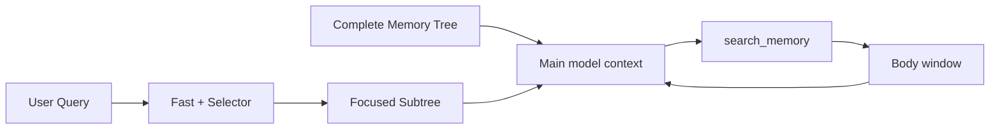
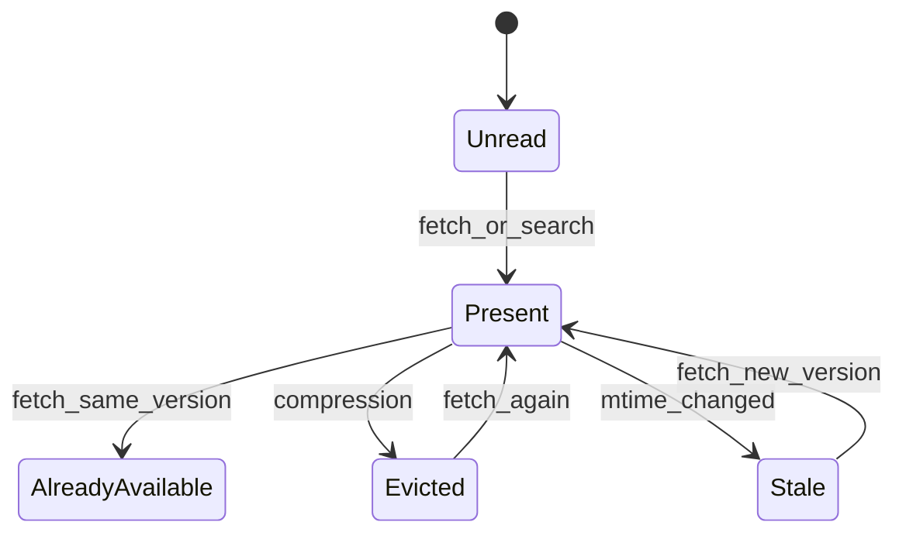

# 结构化 Auto Memory 召回

[English](structured-auto-memory-recall-design.md) | [简体中文](structured-auto-memory-recall-design.zh-CN.md)

## 目标

旧版（legacy）Auto Memory 路径把一份扁平的 `MEMORY.md` 索引加入主模型上下文，
再用选择器或启发式注入选中的记忆正文。随着语料增长，默认上下文一起膨胀，
而模型几乎没有得到任何帮助去理解主题之间的关系。

结构化召回把这种上下文形态改成：

```text
Complete Memory Tree + Focused Subtree + on-demand body
```

完整记忆树（Complete Memory Tree）是一张全局地图，聚焦子树（Focused Subtree）
针对当前请求收窄这张地图，而 `search_memory` 只在元数据不够用时才读取正文。
结构化元数据不完整的既有记忆继续走 legacy 路径，同时由后台迁移逐步补齐。
只有在全部可见记忆都就绪之后，协议才会切换。

本设计的目标是：

- 保留既有记忆文件与正文，无需人工迁移；
- 用分层地图替换主模型上下文里的扁平索引；
- 降低默认上下文与重复正文的 token 成本；
- 同时保留确定性快速召回与基于模型的语义选择；
- 让正文读取、压缩驱逐与文件更新保持一致。

## 存储与作用域

结构化召回不改变记忆路径在 Windows、Linux 与 macOS 上的解析方式。逻辑布局相同，
而基础目录取决于平台与运行时配置。

| 作用域  | 默认位置                                       | 含义                              |
| ------- | ---------------------------------------------- | --------------------------------- |
| Project | `<memory-base>/projects/<project-key>/memory/` | 当前 Git 根目录或工作区的私有记忆 |
| User    | `<memory-base>/memories/`                      | 跨项目的用户偏好与背景            |
| Team    | `<git-root>/.qwen/team-memory/`                | 由 Git 跟踪、团队共享的记忆       |

`QWEN_CODE_MEMORY_BASE_DIR` 覆盖基础目录。只有 Project Memory 认
`QWEN_CODE_MEMORY_LOCAL=1`，它会把 Project Memory 移到
`<project>/.qwen/memory/`。User Memory 仍在全局 memory base 之下；Project
根目录下的 `user/*.md` 文件仍属于 Project Memory。作用域来自被扫描的根，
而不是相对路径的第一段。

全局 memory base 之下的私有 Project 根目录在不受信任的工作区里依然可用。
仓库内的兼容记忆只有在工作区受信任时才可见。设置
`QWEN_CODE_MEMORY_LOCAL=1` 后，Project 根本身就位于仓库内，
因此在工作区受信任之前 Project Memory 不可用。

每个主题文件使用 YAML frontmatter 加上 Markdown 正文：

```yaml
---
name: model-pull-memory-design
description: Qwen Code Auto Memory uses structured metadata and on-demand body retrieval.
type: project
category: tool_experience
keywords:
  - structured memory recall
  - focused subtree
  - search_memory
usage_scenarios:
  - Designing Auto Memory recall behavior
  - Evaluating recall quality and token cost
---
```

`name`、`description`、`category`、`keywords` 与 `usage_scenarios`
描述完整正文，并在其含义变化时刷新。关键词可以是普通词、短语、API、工具名、
issue id 或项目专有标识符。

## 召回协议

### Legacy

如果任一当前可见作用域中存在结构化元数据缺失或无效的记忆，
会话就以 legacy 协议启动：

```text
MEMORY.md -> selector / heuristic -> selected body snippets
```

Legacy 保留已展示路径去重与活动工具噪声过滤。后台迁移不打断这条路径，
因此老记忆在被补齐期间仍可召回。

### Structured

在每条可见记忆都通过元数据校验之后，系统准备新索引与结构化系统提示词。
它确认语料 revision 没有变化，然后原子地提交 `legacy -> structured` 切换。
准备或确认失败会让 legacy 协议继续保持生效。



当前实现只在一次会话内完成 `legacy -> structured` 切换。structured
会话不会因为外部文件变化而立即回退。正常的 Extraction、Remember、Dream 与
Migration 写入必须产出有效元数据，而新会话在初始化时会重新评估语料就绪状态。
切换工作目录会重置召回模式、语料 revision、待投递状态与正文驻留状态，
然后才加载新项目的记忆。

## 完整记忆树

完整记忆树是当前快照的全局元数据地图。它包含分类、无损 `ref` 与标题，
但不含正文，也不含扁平的 `MEMORY.md` 内容：

```text
## Complete memory tree

tool_experience
├── [project:reference/cua-driver-rs.md] cua-driver-rs-reference
└── [project:project/model-pull-memory.md] model-pull-memory-design

project_context
└── [team:reference/release-process.md] release-process
```

记忆树在第一次结构化投递时进入上下文。之后的投递只在语料 revision
变化时发生，并显式替换较旧的记忆树；未变化的完整记忆树不会在每次用户提问时都注入。
主客户端与 ACP 都只在请求真正发出之后才提交已投递的 revision。
失败或取消不会推进投递状态。

`ref` 是协议身份，不是展示文本。它使用作用域加上无损的相对路径编码。
展示层的净化处理无法改变它，并且扫描会检测身份冲突，
使每个文件都保持可唯一获取。

## 聚焦子树

聚焦子树包含完整记忆树中与查询相关的路径。它不是替代性的全局树：

```text
## Memory focus for this turn

The paths below are the query-relevant subtree for this turn. They add focus
to the existing memory tree; they do not replace it.
└── tool_experience
    关键词：structured memory recall, selector latency, search_memory
    ├── [project:project/model-pull-memory.md] model-pull-memory-design
    │   摘要：...
    │   适用：...
    └── [内容已在当前上下文] [project:reference/cua-driver-rs.md] cua-driver-rs-reference
```

同一分类下多个叶子共有的关键词会聚合到父节点上，以避免重复。叶子保留自己的
ref、标题、描述与适用场景。聚焦提示词有固定的字符预算；
必要时它会丢弃排名较低的叶子并报告被省略的数量。

内存中的 `bodyPresentVersions` 状态控制某个叶子是否被渲染为已存在：

- 未读正文暴露元数据，使模型可以搜索或获取；
- 仍在历史中且 mtime 相同的正文使用驻留占位符；
- 压缩驱逐清除驻留状态，使元数据重新可读；
- mtime 变化使旧正文过期，并允许重新读取。

占位符替换的是一个叶子的正文指引。它不会移除该分类聚合后的关键词、ref 或标题。

## 快速召回与选择器

快速打分器与选择器读取同一份快照，但角色不同：

1. 确定性快速打分器最多选出两个候选，并偏向精确标题、标识符、完整关键词短语
   以及多个元数据词命中。
2. 选择器接收有界的元数据清单，执行语义选择与重排。
3. 快速结果可能在第一个可用投递点构成聚焦子树。
4. 精修后的选择器结果在更晚的安全注入点投递，并按 ref 与快速结果合并。
   它绝不会收窄完整记忆树快照。

当实验性的跳过选择器开关
（`QWEN_CODE_MEMORY_RECALL_SKIP_SELECTOR_ON_UNIQUE_STRONG_HIT`，默认关闭）
开启时，第 2、4 步是有条件的：快速命中唯一、查询匹配其标题或关键词，且正文尚未
存在于上下文中时，才跳过选择器——并且该命中还必须是被抑制的选择器本会拿到的候选池中
唯一的标题或关键词匹配，因此排在已发布快速窗口之外的第二个匹配会保留选择器。
仅描述等元数据的子串匹配、正文已存在或过时的情况仍运行选择器。该门槛下任意长度的
非 CJK 标题或关键词都要求 token 边界，因此标题为 `ai` 的记忆不会因为 `explain`
跳过选择器，标题为 `log conventions` 的记忆不会因为 `catalog conventions` 跳过，
关键词 `log` 也不会因为 `catalog` 跳过。CJK 边缘仍按子串匹配，因为书写时没有词分隔符。
混合文字的非 CJK 边缘仍要求边界；相邻 CJK 字符也算作非 CJK token 的分隔符。
`Git文档` 不能因为 `Legit文档` 跳过选择器。
候选池计数同时覆盖排序匹配和严格匹配，避免遗漏与 CJK 字符相邻的短关键词。
候选数量在提示裁剪前计算，
不能因第二个候选被裁掉而触发跳过。
跳过后没有精修结果，共享 client 按快速阶段投递。该开关仍是消融实验，默认行为不变。

提取频率保持原样。#13158 已撤下 #13004 冷却实现：退出尾部和暂停的最旧窗口
需要持久化重放才能保全跳过的事实。相关原始窗口、时间戳、失败次数限制与压缩改动
也已移除。历史代码保留在 `a4568de26e49`，#13004 继续开放。仅选择器的验证不能
冒充提取、质量或 token 节省验收。

短拉丁关键词要求 token 边界，因此 `ai` 不会匹配 `explain`。汉字、平假名、
片假名与谚文使用共享的 CJK 分词器。正文文本是低权重兜底，
不能覆盖明确的元数据命中。

选择器是一次异步旁路查询，不会移除确定性的快速入口。选择器结果被中止、
超时或无效时会兜底回退，而不会中断主请求。选择器清单目前上限为 25,000 字节；
这是一个上下文预算，并不承诺大语料中的每个候选都能到达选择器。

召回仍然会枚举受信任根目录，并在每次扫描时 stat 每个可见文件。由会话的
`MemoryManager` 持有的缓存，只会在文件的解析路径、作用域、mtime、ctime、size
与 inode 都未变化时复用已解析文档。因此文件创建、删除、就地修改与原子替换
都会自然失效，不需要进程级全局快照或 watcher。会话重置与工作目录变化会清空缓存。

## `search_memory`

在 structured 模式下，协议指引主模型通过 `search_memory` 获取托管记忆的正文：

- `search` 在未知精确 ref 时接受一到五个关键词，并可选指定作用域、分类与结果上限；
- `fetch` 读取一个已知 ref，该 ref 必须逐字复制自记忆树或搜索结果；
- `explore` 只列出有界的分类分支元数据，不含正文内容，
  并为每个被截断的分支提供一个 cursor；
- `cursor` 用于继续相邻的正文窗口，不是发起新搜索请求的字段。

关键词校验支持 Unicode 字母与数字，外加汉字、平假名、片假名与谚文。
作用域在扫描前会被稳定去重。排序综合元数据覆盖度、短语与标识符命中、
语料稀有度，以及对先前未命中关键词的覆盖。

search 与 fetch 强制结果数、窗口与正文总量预算。这些预算由工具自己持有，
因此通用调度器不会再截断它的 JSON。被可读文件范围裁掉的窗口不会耗尽整个 ref；
ref 只在其每轮累计正文预算被真正消耗完之后才算耗尽。

每个新的 UserQuery 都会重置轮次内的重复声明与已耗尽 ref。ToolResult 续轮不会。
如果某个文件在快照之后消失，fetch 会把它放进 `missingRefs` 并附带警告，
而不是静默省略。

## 正文驻留与压缩

系统区分「会话中某个时刻读过一次的正文」与「仍在模型历史中的正文」：



当一条 `search_memory` 结果进入历史时，管理器记录它的 ref 与 mtime。
在同一版本仍然存在时再次获取它会返回 `alreadyAvailable`，而不重复正文。
当 microcompaction 或内存压力压缩清掉一条工具结果时，
它会在下一次渲染聚焦子树之前把被驱逐的 ref 报告给管理器。
提示词不能声称一个已被驱逐的正文仍然可用。如果压缩发生在一次投递已准备、
但其状态尚未提交的这段时间里，主循环与 ACP 都会在提交之后再次清理状态，
因此延迟提交无法恢复被压缩移除的 revision 或驻留标记。

在 ToolResult 轮次上，仅按大小的 microcompaction 会在召回消费快照之前运行。
这一顺序由普通模型循环与 ACP 会话共享。

## 托管记忆的工具路由

结构化召回不会把通用 Core 文件工具变成 Memory 文件系统沙箱。`read_file`、Glob、
Grep、目录列举、写入工具与 Shell 保留 Qwen Code 既有的权限与沙箱语义。
结构化提示词告诉主模型：正文读取用 `search_memory`，写入用 `manage_memory`，
不要通过通用工具访问托管记忆路径。这是一条模型路由契约，不是安全边界。

记忆维护 agent 继续使用各自受限的权限管理器与受信任根检查来完成自己负责的操作。
通用子 agent 与外部记忆系统不会获得任何新的隐式 Memory 集成，
但本设计也不会给通用文件工具增加能力开关，或尝试解析每一种可能的 Shell 命令。

## 元数据写入方与后台任务

有四条写入路径维护结构化元数据：

- Extraction 从新的对话历史中提炼持久信息。
- Remember 处理用户显式的记忆请求。
- Dream 与 User Dream 整合、去重并拆分既有记忆。
- Migration 只补齐 legacy 文件；它不替代日常的 Dream 工作。

一个迁移批次最多尝试 10 个文件，最多读取 40,000 个正文字符。每个完成的
UserQuery 在普通模型循环与 ACP 中都最多调度一个 Project 批次和一个 User 批次。
候选扫描之前会先取得进程级 single-flight 占用，
因此同一进程内的会话不会并发启动同一个作用域/根。调度返回 `running`；
它不会排队自动续跑。不同进程之间不共享迁移锁；如果它们重叠，逐文件的 no-follow
与 source-hash/CAS 检查可防止陈旧写入。一次性 headless
进程不会在退出前隐式自行排空额外批次，从而保住它的时延与后台模型成本。
既有任务界面会展示迁移任务并支持取消。

Project Dream 与 User Dream 按根使用 PID/mtime 锁，
因此多个会话不能并发整合同一份语料。拿不到锁的会话返回 `locked`，
且不会自动排队。Dream 保留其既有的变更量、时间与文档数量触发条件；
它不负责迁移每一个老文件。

`pinned/` 是受保护的用户区域。受限的维护工具不能修改 pinned 文件，Dream
的清单执行器会拒绝对 pinned 路径的删除、去重与拆分操作。每次 Dream
运行在取得锁之后、启动 planner 之前，都会移除陈旧清单，
使上一次异常退出无法在后续运行中调度操作。

## 迁移安全与一致性

迁移遵循以下约束：

- 保留正文内容，只更新 frontmatter；
- 在读取正文之前拒绝符号链接的记忆根与越出根边界的路径；
- 提交叶子时使用 no-follow 与 source-hash/CAS 检查；
- 并发消失的文件跳过，同时保留已提交的进度；
- 把权限与根安全错误报告为作用域失败，绝不报告为就绪；
- 把缺失的兼容根视为 no-op，不去创建它；
- 向后续元数据生成暴露每个已提交的规范短语。

只有当每个被请求的作用域都通过校验时，就绪状态才为真。在提交 structured
协议之前，revision 复核与提示词构造都必须成功；该步骤中的 legacy
索引重建是尽力而为的，因为结构化提示词由扫描构造，而不是由那些索引构造，
所以某个读不到或写不了的层级不能阻塞切换。

## 可观测性

遥测记录：

- 召回扫描、快速打分、选择器与投递的耗时；
- 完整记忆树的投递与丢弃原因；
- search/fetch/explore 的结果数、正文字符数与来源状态；
- 迁移的扫描、legacy、提交、冲突、失败、token 与耗时数据；
- 召回模式切换。

日志不包含查询文本、记忆正文或物理记忆路径。只有当对应的时间线遥测存在时，
评测才可以声称选择器命中率与投递耗时。

## 质量与成本

structured 模式应当通过移除扁平的 `MEMORY.md`、避免重复正文、
按需读取有界窗口来降低主上下文 token。完整的主题地图、元数据快速召回
与语义选择器应当让召回更稳定。这些是设计假设，本身不是证据。

评测必须在相同模型、相同仓库 revision、相同记忆语料、
相互独立的全新上下文与固定用例下比较 Legacy 与 Structured。它应当报告：

- 任务与召回质量；
- 召回贡献、漏召与工具失败；
- 主路径与后台任务的 token；
- P50/P95 时延与运行时失败；
- 选择器耗时、记忆树/子树投递与正文读取行为。

当前的大样本评测在质量差值上的置信区间跨越零点，
因此它没有确立显著的质量提升。它确实显示了更低 token 与中位时延的信号。
在把这些测量当作最终结论之前，必须在最新的正确性修复之后重跑相同用例。

## 非目标

本设计目前不包含：

- 在一次 headless 调用退出前自动跑完每个迁移批次；
- 在没有评测证据的情况下提高选择器清单预算；
- 让 Dream 负责完整的 legacy 语料迁移；
- 自动向通用子 agent 或外部记忆系统注入结构化 Memory 上下文或专用 Memory 工作流；
- 把逐用例评测数据、原始 API 日志或完整 transcript 作为设计的一部分提交进仓库。

## 小结

结构化召回把 Auto Memory 从一堆扁平正文变成一张可导航、可搜索、
按需读取的记忆地图。完整记忆树提供全局理解，聚焦子树提供任务焦点，
快速召回与选择器挑选路径，`search_memory` 管理正文窗口与驻留。Legacy 兜底
与增量迁移保护既有记忆，而原子协议投递、受信任根检查与压缩反馈让系统在
长时间运行与多会话使用中保持一致。
