# Session attachment chunk upload

[English](session-attachment-chunk-upload.md) | [简体中文](session-attachment-chunk-upload.zh-CN.md)

## Status

Implemented on the PR branch, rebased onto main on 2026-09-28. Tracks [#11958](https://github.com/QwenLM/qwen-code/issues/11958).
Source investigation used `af4da3471` (v0.23.4) and verified the reported raw
upload route and SDK method at the issue's pinned commit `3fc1133d`.

## Problem and evidence

The SDK sends an entire attachment as a raw
`POST /session/:id/attachments?name=...`. The daemon and attachment store accept
up to 8 MiB, but an upstream proxy can reject a smaller request first. A
daemon-side body-limit change cannot change the upstream limit.

The baseline reproduction used the installed `qwen 0.23.4`, native `fetch`
with the SDK's request shape, and a Node HTTP proxy imposing a 1 MiB body limit:

| Input                      | Direct daemon                            | Through proxy                            |
| -------------------------- | ---------------------------------------- | ---------------------------------------- |
| Valid PNG, 1,770,848 bytes | 201; download matches the original bytes | HTML 413; not forwarded or stored        |
| Valid PNG, 49,363 bytes    | Not required for this control            | 201; download matches the original bytes |
| Body of 8,388,609 bytes    | JSON 413, max 8 MiB                      | Not required for this control            |

This verifies the size-boundary failure, not actual nginx/OpenResty or browser
clipboard interaction. The local investigation record is
`.qwen/issues/issue-11958.md`; it is not a published documentation dependency.

## Goals and scope

- Upload images and arbitrary files of at most 8 MiB through a proxy that accepts
  individual bodies of 1 MiB, without changing their bytes.
- Keep `uploadSessionAttachment()` / `uploadAttachment()` signatures and the
  returned attachment reference unchanged. Cover normal send, queued prompts,
  mid-turn insertion, and direct SDK consumers.
- Preserve session ownership, authentication, filename handling, persistent
  attachment storage, and the legacy one-request endpoint.
- Bound temporary resource use and define retries and cancellation explicitly.

This design covers session attachments only. Workspace file uploads, extension
archives, voice uploads, image compression, resumable uploads across restarts,
parallel chunks within one file, and general reverse-proxy deployment support
are separate work. It introduces no CLI flags or host configuration options.
A proxy with a body cap below 512 KiB remains outside this transport guarantee.
The same 1 MiB proxy can still reject larger requests to `/file/upload` (up to
50 MiB), extension archives, or voice uploads; this PR does not make those
routes proxy-compatible.

## Decisions

| Decision                                                          | Rationale                                                                                            |
| ----------------------------------------------------------------- | ---------------------------------------------------------------------------------------------------- |
| SDK automatically chunks files larger than 512 KiB when supported | The transport belongs below Web Shell; all callers get the same behavior.                            |
| New sibling upload endpoints                                      | An old daemon must never save a chunk as a complete attachment by ignoring unknown query parameters. |
| Sequential raw chunks and an explicit completion request          | Simple offset validation; only completion can publish an attachment.                                 |
| Bounded in-memory staging owned by the session attachment store   | The file cap is only 8 MiB; reuse session cleanup without partial files or crash scavenging.         |
| Application-level chunks in separate HTTP requests                | Streaming one HTTP body does not remove that request's body-size limit.                              |
| All upload writes use POST or DELETE and existing headers         | Current CORS allows these methods, but does not allow PUT or custom offset headers.                  |

## Wire contract

### Discovery and constants

The daemon advertises `session_attachment_chunk_upload` in `capabilities.features`
alongside `session_attachments`. The new feature identifies this complete
contract, including a 524,288-byte chunk limit and an 8,388,608-byte file limit;
it is advertised only when all four endpoints are wired. No new configurable
limit fields are added to capabilities.

Let `U` mean `/session/:id/attachment-uploads` in the table below. Every route is
**live-session-owner** scoped. `uploadId` is an opaque daemon-generated UUID,
never a filename or path. Successful JSON responses use `Cache-Control: no-store`.

| Request                            | Input                                               | Success                                         |
| ---------------------------------- | --------------------------------------------------- | ----------------------------------------------- |
| `POST U`                           | JSON `{ name, mimeType, size }`                     | 201 `{ uploadId }`                              |
| `POST U/:uploadId/chunks?offset=N` | Raw bytes, `Content-Type: application/octet-stream` | 200 `{ offset }`, the next accepted byte offset |
| `POST U/:uploadId/complete`        | No body needed; JSON body is ignored                | 200, existing attachment reference              |
| `DELETE U/:uploadId`               | Empty body                                          | 204 for an incomplete or already absent upload  |

The bearer and optional `X-Qwen-Client-Id` headers retain existing semantics.
The absence of a client ID is a distinct owner value, not a wildcard. This
preserves direct SDK callers, including `qwen-live`, that currently omit it.

### Create

Validate the existing filename and MIME compatibility rules before allocating.
`size` must be an integer in `[0, 8388608]`; empty image uploads are rejected,
while empty ordinary files remain valid. Metadata is immutable after creation.
Enforce a 4 KiB request-body limit on this JSON endpoint.

Synchronously reserve the full declared size and one active-upload slot before
allocating a zero-initialized buffer of that size. Allocation failure rolls back
the reservation. Return the ID only after the record exists. Creation has no
automatic retry after a network error or an ambiguous response; an unreachable
record expires without ever becoming an attachment.

### Append

Require exactly one decimal, non-negative safe-integer `offset`. Reject duplicate
query values, unsupported content types, and content encodings other than absent
or `identity`. Each body is nonempty and at most 524,288 bytes. Non-final chunks
must be exactly 524,288 bytes; the final chunk must have exactly the remaining
size. Zero-byte files go directly to completion.

- At the current offset, copy into the preallocated buffer and advance the offset
  synchronously, before yielding to another request.
- A retry of the immediately preceding chunk succeeds only if its offset,
  length, and bytes match the accepted chunk. Return the same next offset.
- Gaps, overlaps, altered retries, and older chunks return
  `409 attachment_upload_offset_conflict` without mutation.
- Bytes beyond the declared total return `413 attachment_upload_too_large`.

Once completion starts, no further chunk may modify the buffer. No base64,
multipart envelope, client-supplied digest, or chunk-count field is needed.

### Complete and cancel

Completion requires the received size to equal the declared size; otherwise
return `409 attachment_upload_incomplete`. Transition synchronously to
`completing` and retain one completion promise. Concurrent completion requests
await that promise; they never invoke storage twice. On success, retain the
existing reference as a receipt and drop the buffer. Repeated completion returns
the same reference, including the deduplicated filename.

An actual storage failure is terminal for that ID: retain its failure result for
the receipt window and release staging after the write settles. A repeated
completion returns that failure instead of attempting a second storage write.
If a concurrent session copy temporarily blocks storage, completion returns
`503 attachment_upload_store_busy` with `retryable: true` and retains the bytes
so the same upload ID can be completed after the copy finishes.

DELETE discards a receiving/ready upload. Once completion has started, DELETE
returns `409 attachment_upload_finalizing`; after success it returns
`409 attachment_upload_completed`. It never removes a persisted attachment.
Removal of completed attachments continues through the existing attachment API.
Client cancellation cannot promise rollback after the completion boundary.
DELETE may also discard a terminal failure receipt; subsequent DELETE is 204.

Unknown, expired, cancelled, evicted, or differently owned IDs return
`404 attachment_upload_not_found` on append/complete. DELETE may return 204 for
an absent or differently owned ID but must never mutate another owner's record.
Append/complete never recreate a missing ID. Exactly-once storage is scoped to
one upload ID in one live store, not to repeated user submissions or restarts.

### Errors

Use `{ error, code }` for new protocol errors. Preserve existing authentication,
client, session, trust, archive, and runtime error envelopes.

| Status | New conditions                                                 |
| ------ | -------------------------------------------------------------- |
| 400    | Invalid metadata, empty image/chunk, malformed offset          |
| 404    | `attachment_upload_not_found`                                  |
| 409    | Offset conflict, incomplete file, finalizing/completed upload  |
| 413    | File, chunk, or metadata body exceeds its limit                |
| 415    | Unsupported chunk content type or content encoding             |
| 429    | `attachment_upload_capacity_exceeded`; no allocation performed |
| 500    | Storage failure, with internal detail kept out of the response |
| 503    | Store temporarily busy copying session attachments             |

The existing opt-in mutation rate limiter also covers these requests. No route
is exempted and no existing rate limit is raised. Its `Retry-After` remains
distinct from staging-capacity exhaustion.

## Ownership and publication

All four handlers use `mutate()` and the existing owner-session wrapper. Resolve
the live owner on every request; perform bridge client validation before reading
or modifying the upload record. Bind records to the actual store instance and
the exact creator client value. A matching session string or upload UUID cannot
transfer an upload to a new runtime, reloaded session, or reattached client.

Unknown sessions, ambiguous owners, untrusted workspaces, bootstrapping/draining
or removed runtimes retain the owner resolver's existing failure semantics. None
falls back to the primary runtime. Each request holds its ordinary archive
shared lock; no lock spans multiple HTTP requests.
The existing single-runtime lookup shortcut still requires the bridge to find
the live session before allocating or accessing an upload; it cannot create a
store for an unknown session.

Completion uses the captured store and runtime throughout. Pass an
`assertCanCommit` check to the storage boundary that verifies runtime generation,
live-entry identity, and creator registration before writing and after the
asynchronous write, before releasing the reserved filename or publishing the
reference. This extends the existing store's closed/closing checks; entry-time
generation checking alone is insufficient. On failed validation, use the
existing failed-write removal path. This is in-process publication safety, not
a new crash-atomic disk-storage guarantee. If failed-write cleanup also fails,
keep that name excluded for the lifetime of the current store.

Pending chunks are never listed, read, referenced in prompts, copied to forks,
or persisted as sources. A final write uses the existing pending-name exclusion
and `putAttachment()` filename/MIME rules. Before this change, `list()` excluded
pending names but `read()` and `assertStored()` did not. Both now check pending
names, so guessing a filename cannot read or admit a reference to an incomplete
or not-yet-authorized final write. Reference resolution uses the guarded read;
prompt/source admission uses the guarded reference assertion. Copying a session
includes only completed attachments; it does not wait for a multi-request upload
to finish.

An entry-time pending-name check alone is insufficient because `read()` awaits
directory lookup and file I/O. Order on-disk reads and final writes through a
narrow per-store publication gate: concurrent readers share a batch, while a
writer waits for prior readers and holds the gate through commit validation or
failed-write cleanup. A read that starts first finishes before a new write
creates its file; a read that follows a write sees only its settled result.
Apply this to both legacy and chunked final writes in the shared store. Keep
receiving chunks outside this gate. Synchronous reference admission rejects
pending names instead of waiting. A queued write reserves its original name
against deletion without hiding an existing same-name reference. Reuse the
existing pending-write/copy coordination so queued writes cannot bypass close
or deadlock with session copying; this needs no general locking framework.

## State, resources, and lifecycle

```mermaid
stateDiagram-v2
    [*] --> receiving: create
    receiving --> receiving: append or identical last-chunk retry
    receiving --> completing: complete with all bytes
    completing --> receiving: concurrent copy; retry later
    completing --> completed: storage succeeds
    completing --> failed: storage or commit check fails
    receiving --> [*]: cancel / expiry / close
    completed --> [*]: receipt expiry / eviction / close
    failed --> [*]: receipt expiry / eviction / close
```

All constants below are internal initial defaults, not additional product limits
on already stored attachments:

| Resource                                     | Bound                                                                                          |
| -------------------------------------------- | ---------------------------------------------------------------------------------------------- |
| Staged buffers, including writes in progress | 128 MiB per process across all bridge/runtime instances                                        |
| Active uploads                               | 32 per process; 8 per live session store                                                       |
| Receiving lifetime                           | 5 minutes from creation, not extended by retries                                               |
| Success/failure receipts                     | Up to 5 minutes after settlement; at most 1024 per process, evict oldest settled receipt first |
| Expiry sweep                                 | Every 30 seconds while records exist; unref and stop when empty                                |
| SDK concurrent chunked files                 | 2 per DaemonClient; one chunk in flight per file                                               |

Reserve bytes before allocation, not after a chunk arrives. Copy chunks directly
into the one reserved buffer; completion must not `Buffer.concat` another full
file. Fixed process-shared counters belong to the attachment helper; the journal
growth and daemon memory budgets do not account for these buffers. The 128 MiB
bound excludes request-parser buffers and existing single-request uploads and
must not be described as a total daemon RSS bound.

Check expiry on every operation as well as the sweep. Expiry and session/client
closure immediately invalidate pending records. A completion already holding
its buffer keeps its byte reservation until its write settles, even when the
store is closed; release counters exactly once in finalization. A completing
record is not evicted by the receipt cache or expiry sweep. Closed stores retain
no receipts after their in-flight operations settle.

Integrate helper cleanup into `SessionAttachmentStore.close()` and `delete()`;
cancel a client's pending uploads when its last registration is removed. Existing
session close, kill, child exit, failed restore, archive/delete, and runtime
shutdown then own the cleanup. Persistent completed files retain their current
close/delete behavior. Restart loses every temporary ID; no startup scavenger is
needed because staging never writes partial files.

Before this change, `bridge.shutdown()` captured `entries` and cleared `byId`,
then enumerated `byId.values()` for attachment close. The cleanup now uses the
captured `entries`; a regression test checks that shutdown closes their stores.

## SDK and caller behavior

1. Validate the 8 MiB file limit before transfer; check caller cancellation before
   discovery, queueing, and every request.
2. For files at most 512 KiB, use the existing one-request endpoint. For larger
   files, inspect REST capabilities using the client's authenticated REST fetch.
   Coalesce valid REST discovery for 60 seconds, separately from transport
   discovery, which may be served through ACP-WS. A
   successful legacy response without the feature chooses the legacy endpoint;
   authentication, network, malformed-response, and server failures propagate as
   upload errors, without triggering a legacy 404 fallback.
3. When supported, acquire one of two abortable SDK upload slots, create the
   upload, send sequential `Blob.slice()` bodies, and complete. Validate IDs,
   acknowledged offsets, and final reference size before returning. Release the
   slot on every exit. Queued callers allocate no daemon staging buffer.
4. Use direct REST for the binary upload path even with ACP-HTTP/ACP-WS selected,
   following the existing workspace-file upload precedent. Preserve injected
   fetch, bearer, client identity, and timeout handling. No ACP route mapping is
   added. This also applies to the legacy binary upload branch of this method.
5. Retry an identical append/complete request at most twice for network errors,
   per-request timeouts, and HTTP 502/503/504. Use 200 ms then 400 ms delay. For
   rate-limit 429, honor a valid `Retry-After` within the operation deadline;
   staging-capacity 429 is surfaced immediately. Abort cancels requests and waits.
   Bound the chunked operation to 5 minutes after creation starts; retain the
   existing per-request timeout. Never restart with a new ID after ambiguous
   completion, and never fall back to raw or inline content after chunking starts.
6. On failure/cancellation, attempt one DELETE with a separate bounded 2-second
   cleanup signal. Cleanup failure does not mask the original error; server
   expiry covers it. A finalizing/completed upload follows the cancellation
   boundary above, so a completed file can remain after a lost response.

Creation may retry a definitive rate-limit rejection under the same bounded wait
policy, but not an ambiguous creation outcome. Append/complete 400/404/409/413/415
fail immediately. Receipt eviction or a daemon restart fails the current upload;
the SDK does not infer success or transparently create a replacement.

### Client identity repair and errors

`DaemonSessionClient.uploadAttachment()` currently wraps the entire operation in
`withClientIdSelfHeal()`. Preserve that safe repair only before a chunked upload
ID is acquired (including a definitive `invalid_client_id` create rejection).
Once chunk mode is selected, wrap failures in `DaemonAttachmentUploadError`
carrying the original cause, except for a definitive pre-ID `invalid_client_id`
rejection and caller cancellation. The wrapper must not be recognized as a
retryable admission error. This also covers a create endpoint returning 404
despite the advertised capability.
Expose the original HTTP status for diagnostics except that upload-internal 404
must not reach Web Shell's legacy raw-endpoint 404 fallback: it means the current
upload failed, not that attachment support is absent. Test that distinction
explicitly. Caller cancellation remains an abort error.

For attachment-upload 413 responses, preserve the daemon's structured size
error. When a file within 8 MiB receives a generic 413, give an actionable
message that the server or an intermediary rejected the request body and a
proxy limit may be lower.
Do not assert that every 413 originated in a proxy. Preserve the original status
and body as diagnostic data. No generic HTTP-error rewrite is needed.

Web Shell's upload API and attachment content stay unchanged. Add regressions for
normal send, queued/mid-turn insertion, and failure cleanup. Direct callers such
as `qwen-live` benefit without having to add a client ID. Small-file legacy
behavior and legacy 404 fallback remain covered separately.

## Implementation map

Paths in this table are relative to the repository root. They identify the
implementation and its downstream consumers.

| Layer / files                                                                           | Change and downstream consumers                                                                                                                                                                                                                       |
| --------------------------------------------------------------------------------------- | ----------------------------------------------------------------------------------------------------------------------------------------------------------------------------------------------------------------------------------------------------- |
| `packages/acp-bridge/src/session-attachment-uploads.ts` (new)                           | Attachment-only state machine, shared reservation/receipt bounds, expiration and idempotence; consumed by the session attachment store.                                                                                                               |
| `packages/acp-bridge/src/sessionAttachments.ts`                                         | Own the helper, validate metadata through existing rules, complete through guarded storage, coordinate read/final-write publication and reference admission, and clean up on close/delete. Read/list/resolve/copy consumers see completed files only. |
| `packages/acp-bridge/src/session-control-plane.ts`, `bridgeTypes.ts`                    | Four bridge operations, per-call creator checks, last-client cleanup, and the shutdown snapshot correction; CLI handlers and bridge test doubles consume the interface.                                                                               |
| `packages/cli/src/serve/routes/session.ts`                                              | Four handlers, owner/commit guards, narrow body parsers, protocol errors; keep existing attachment routes.                                                                                                                                            |
| `packages/cli/src/serve/server/error-handlers.ts`                                       | Skip the global JSON parser for the exact new create/chunks POST paths, including case/trailing-slash behavior; create gets its own 4 KiB JSON parser, chunks their 512 KiB raw parser.                                                               |
| `packages/cli/src/serve/capabilities.ts`, `server/telemetry.ts`                         | Feature flag and fixed route templates for all four endpoints; prevent upload IDs becoming metric labels.                                                                                                                                             |
| `packages/sdk-typescript/src/daemon/DaemonClient.ts`, SDK daemon exports                | Automatic transport choice, bounded queue/retry/cleanup, response validation, REST binary path, and upload-specific error.                                                                                                                            |
| `packages/sdk-typescript/src/daemon/DaemonSessionClient.ts`                             | Existing identity repair remains unchanged; regression tests verify the upload error boundary prevents post-allocation replay.                                                                                                                        |
| SDK, CLI, bridge, and Web Shell tests                                                   | Cover wire behavior and existing consumers in `actions.ts`, `useQueuedPrompts.ts`, and `qwen-live`'s adaptor.                                                                                                                                         |
| `docs/developers/qwen-serve-protocol.md`, user upload troubleshooting, this design pair | Document the implemented contract, compatibility, and limits when implementation lands. The existing protocol reference is English-only; this design pair contains the complete bilingual proposal.                                                   |

Keep the helper package-internal and avoid a general upload framework. No changes
to `packages/core`, ACP child protocol, attachment reference types, or the curated
public REST OpenAPI surface are required. Locate all bridge interface test doubles
and update them; do not mask missing implementations with optional methods.

## Validation and acceptance

| Area                     | Required checks                                                                                                                                                                                                                                                                                                                                                                                                                                                                  |
| ------------------------ | -------------------------------------------------------------------------------------------------------------------------------------------------------------------------------------------------------------------------------------------------------------------------------------------------------------------------------------------------------------------------------------------------------------------------------------------------------------------------------- |
| Transport boundary       | Through the 1 MiB proxy, upload PNG and arbitrary binary fixtures of 512 KiB + 1, 1 MiB + 1, 8 MiB - 1, and exactly 8 MiB; download and compare bytes/hash. Every chunk request is at most 512 KiB.                                                                                                                                                                                                                                                                              |
| Legacy limits            | At/below 512 KiB keeps one upload request; empty text works; empty images and 8 MiB + 1 fail. Old SDK/new daemon and new SDK/old daemon remain usable on a direct connection.                                                                                                                                                                                                                                                                                                    |
| Retries                  | Lose a chunk response after acceptance and a completion response after storage; retry the same request and produce exactly one attachment. Altered duplicates/gaps/overlaps fail without corrupting the buffer.                                                                                                                                                                                                                                                                  |
| Failure and cancellation | Abort queued/receiving/finalizing operations separately; expire abandoned creates; reject incomplete completion; force storage failure; verify each reservation releases once and uncertain completion does not restart.                                                                                                                                                                                                                                                         |
| Identity and runtime     | Two registered clients, omitted client ID, stale registration, same session ID in different runtimes, owner ambiguity, untrusted/draining/removed runtime, and generation closure during disk write; no cross-owner read/write or primary fallback.                                                                                                                                                                                                                              |
| Lifecycle and capacity   | Close, kill, child exit, archive/delete, restart and runtime removal; receipt eviction; quota across two bridge instances; failed allocation; fork/copy excludes partial uploads; Pause the final write, attempt GET and prompt/source reference admission for its guessed filename, then fail the commit guard: no content is visible. Also start the GET before the final write and delay its file open; verify the same guarantee. Include the shutdown `entries` regression. |
| SDK integrations         | Injected fetch and ACP transports use REST for upload; 429 honors Retry-After; abort interrupts waiting; HTML 413 and create/chunk/complete 404 remain upload failures; identity repair cannot replay completion.                                                                                                                                                                                                                                                                |
| Web Shell                | Browser paste/drop, normal send, queued and mid-turn insertion, preview, multiple files, and cleanup after one file fails. Verify no automatic raw/inline fallback after chunking starts.                                                                                                                                                                                                                                                                                        |
| HTTP integration         | Cross-origin preflight uses existing headers/methods; metadata/raw parser limits work for JSON file attachments, malformed bodies, case variants and trailing slashes; telemetry uses fixed route templates.                                                                                                                                                                                                                                                                     |

Verification uses the global CLI baseline and the built local CLI, with scripts
and results under `.qwen/e2e-tests/session-attachment-chunk-upload.md`. Real SDK
uploads of PNG and binary fixtures at 524,289, 1,048,577, 8,388,607 and 8,388,608
bytes passed through a Node proxy with a 1 MiB request cap and matched byte for
byte. Lost append/completion responses reused the same upload ID and stored one
attachment. Package tests cover reservation bounds, receipts, publication races,
identity repair, cancellation, and Web Shell send/queue/mid-turn consumers.
An isolated native Chrome paste/send/preview run through a local 1 MiB proxy
also confirmed the model provider received the clipboard image bytes; Chrome's
re-encoded PNG decoded to the same pixels as the source. These tests did not
exercise the operator's actual gateway. Browser drop, queued/mid-turn send, and
multi-file failure cleanup were not manually exercised.

Acceptance requires byte-identical uploads through the target proxy, unchanged
references, bounded staging across runtimes, safe lost-response retries, and no
attachment publication after an owner/commit guard fails. Each language version
must remain synchronized with the implemented protocol.

## Tradeoffs and follow-up

An 8 MiB attachment takes 18 upload requests: create, 16 chunks, complete, plus
discovery if uncached. This trades latency for compatibility with restricted
gateways; two file-level upload slots limit bursts. The existing rate limiter may
delay uploads and is intentionally still effective.

If an operator controls every intermediary, increasing the proxy body cap is
still the cheapest deployment solution. Raising only the daemon cap is
ineffective here. Clipboard compression can reduce traffic but changes image
quality and cannot cover arbitrary files.

The defaults above are concrete starting decisions. Before implementation
merges, maintainers should confirm the staged-memory budget and that the pilot
gateway accepts 512 KiB raw bodies and these sibling paths. Other binary ingress
routes can adopt the proven pattern in separate changes without blocking session
attachments.
