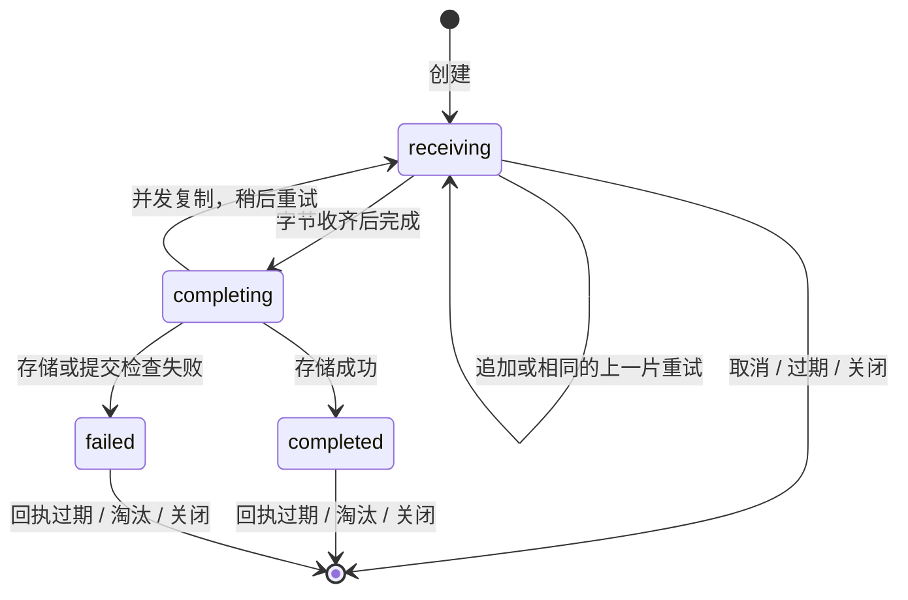

# 会话附件分片上传

[English](session-attachment-chunk-upload.md) | [简体中文](session-attachment-chunk-upload.zh-CN.md)

## 状态

已在 PR 分支实现，并于 2026-09-28 变基到主干。关联
[#11958](https://github.com/QwenLM/qwen-code/issues/11958)。源码调查基于
`af4da3471`（v0.23.4），并在 issue 固定的提交 `3fc1133d` 上核对了所报告的
raw 上传路由和 SDK 方法。

## 问题与证据

SDK 通过 `POST /session/:id/attachments?name=...` 一次发送整个附件的原始字节。
daemon 和附件存储允许最多 8 MiB，但上游代理可能先拒绝更小的请求。修改 daemon
的请求体限制无法改变上游限制。

基线复现使用已安装的 `qwen 0.23.4`、按 SDK 请求形态发送的原生 `fetch`，以及
将请求体限制为 1 MiB 的 Node HTTP 代理：

| 输入                     | 直连 daemon               | 经过代理                  |
| ------------------------ | ------------------------- | ------------------------- |
| 有效 PNG，1,770,848 字节 | 201；下载字节与原文件一致 | HTML 413；未转发、未存储  |
| 有效 PNG，49,363 字节    | 此对照无需重复验证        | 201；下载字节与原文件一致 |
| 8,388,609 字节请求体     | JSON 413，max 8 MiB       | 此对照无需重复验证        |

该测试验证了请求大小限制导致的失败，没有运行实际 nginx/OpenResty 或浏览器
剪贴板操作。本地调查记录位于 `.qwen/issues/issue-11958.md`，发布的文档不依赖
该本地文件。

## 目标与范围

- 在接受单个 1 MiB 请求体的代理后，上传不超过 8 MiB 的图片和任意文件，保持
  原始字节不变。
- 保持 `uploadSessionAttachment()` / `uploadAttachment()` 签名及返回的附件引用
  不变，覆盖普通发送、排队提示、中途插入和 SDK 直接调用方。
- 保持会话归属、鉴权、文件名处理、附件持久化存储和旧的单请求接口。
- 限制临时资源占用，明确重试与取消的行为。

本设计只覆盖会话附件。工作区文件上传、扩展归档、语音上传、图片压缩、跨重启
断点续传、单文件内部并行分片，以及通用反向代理部署支持，均另行处理。不新增
CLI 参数或宿主配置选项。请求体上限低于 512 KiB 的代理不在本传输方案的保证
范围内。
同一个 1 MiB 代理仍可能拒绝 `/file/upload`（上限 50 MiB）、扩展归档或语音上传的
较大请求；本 PR 不会让这些路由兼容该代理。

## 设计决策

| 决策                                              | 原因                                                               |
| ------------------------------------------------- | ------------------------------------------------------------------ |
| 支持新协议时，SDK 自动对大于 512 KiB 的文件分片   | 传输逻辑放在 Web Shell 下层，让所有调用方获得一致行为。            |
| 新增同级上传端点                                  | 避免旧 daemon 忽略未知 query 参数，把一个分片保存为完整附件。      |
| 顺序发送原始字节分片，显式请求完成                | offset 校验简单；只有完成操作可以发布附件。                        |
| 由会话附件存储持有有界的内存暂存数据              | 文件上限只有 8 MiB；复用会话清理机制，无需半成品文件或崩溃后扫描。 |
| 每个应用层分片使用独立 HTTP 请求                  | 单个 HTTP 请求的流式发送不会解除该请求的 body 大小限制。           |
| 所有上传写操作使用 POST 或 DELETE，沿用现有请求头 | 当前 CORS 已允许这些方法，但未允许 PUT 或自定义 offset 请求头。    |

## 线协议

### 能力发现与常量

daemon 在 `capabilities.features` 中同时声明 `session_attachment_chunk_upload`
和已有的 `session_attachments`。新能力对应本文完整协议，包括 524,288 字节分片
上限和 8,388,608 字节文件上限；只有四个端点全部接入后才声明。capabilities 不
新增可配置的限制字段。

下表用 `U` 表示 `/session/:id/attachment-uploads`。所有路由均属于
**live-session-owner** 范围。`uploadId` 是 daemon 生成的不透明 UUID，不能作为
文件名或路径。成功的 JSON 响应使用 `Cache-Control: no-store`。

| 请求                               | 输入                                               | 成功响应                                     |
| ---------------------------------- | -------------------------------------------------- | -------------------------------------------- |
| `POST U`                           | JSON `{ name, mimeType, size }`                    | 201 `{ uploadId }`                           |
| `POST U/:uploadId/chunks?offset=N` | 原始字节，`Content-Type: application/octet-stream` | 200 `{ offset }`，表示下一个可接收的字节位置 |
| `POST U/:uploadId/complete`        | 无需请求体；JSON 请求体会被忽略                    | 200，返回现有附件引用                        |
| `DELETE U/:uploadId`               | 空请求体                                           | 未完成或已不存在的上传返回 204               |

Bearer 和可选的 `X-Qwen-Client-Id` 请求头沿用现有语义。缺省 client ID 是一种
独立的所有者值，不是通配符。这样可兼容当前不传 client ID 的 SDK 直接调用方，
包括 `qwen-live`。

### 创建

分配资源之前，按现有规则校验文件名和 MIME 的兼容性。`size` 必须是
`[0, 8388608]` 范围内的整数；拒绝空图片，允许普通空文件。创建后元数据不可
更改。该 JSON 端点的请求体上限为 4 KiB。

先同步预留完整声明大小和一个活动上传名额，再分配对应大小的零初始化缓冲区。
分配失败时回滚预留。记录存在后才返回 ID。网络错误或响应结果不明确时不自动
重试创建；客户端拿不到的上传记录会过期，且不会成为附件。

### 追加分片

`offset` 必须只出现一次，值为十进制非负安全整数。拒绝重复 query 值、不支持
的 Content-Type，以及既非缺省也非 `identity` 的 Content-Encoding。每个请求体
非空且不超过 524,288 字节；非末尾分片必须恰好为 524,288 字节，末尾分片必须
恰好等于剩余大小。零字节文件直接进入完成步骤。

- offset 等于当前位置时，将字节复制到预分配缓冲区，同步推进 offset，再交出
  执行权供其他请求运行。
- 重试紧邻的上一片时，只有 offset、长度、字节全部相同才成功，返回同样的
  下一个 offset。
- 跳跃、重叠、内容变化的重试和更早的分片，均返回
  `409 attachment_upload_offset_conflict`，不修改数据。
- 超出声明总大小的字节返回 `413 attachment_upload_too_large`。

开始完成操作后，任何分片都不能再修改缓冲区。无需 base64、multipart 封装、
客户端摘要或分片总数字段。

### 完成与取消

完成要求已接收字节数等于声明大小，否则返回
`409 attachment_upload_incomplete`。同步进入 `completing` 状态并保留唯一的
完成 Promise。并发完成请求等待同一个 Promise，不会重复调用存储。成功后保存
现有附件引用作为回执，释放缓冲区。重复完成返回相同引用，包括去重后的文件名。

实际存储失败后，该 ID 进入终态：在回执保留窗口内记录失败结果，写入结束后
释放暂存资源。重复完成返回相同失败，不再执行第二次存储写入。
如果并发的会话复制暂时阻止存储，完成操作返回带 `retryable: true` 的
`503 attachment_upload_store_busy`，并保留字节，复制结束后可用同一上传 ID
再次完成。

DELETE 丢弃正在接收或已收齐的上传。开始完成后，DELETE 返回
`409 attachment_upload_finalizing`；成功后返回
`409 attachment_upload_completed`。该操作不删除持久化附件，已完成附件继续
通过现有附件 API 删除。越过完成边界后，客户端取消不能保证回滚。
DELETE 也可以丢弃终态失败回执，后续 DELETE 返回 204。

追加和完成操作对未知、过期、已取消、回执已淘汰或属于其他所有者的 ID，返回
`404 attachment_upload_not_found`。DELETE 对不存在或属于其他所有者的 ID
可以返回 204，但不能修改其他所有者的记录。追加与完成都不能重建已消失的 ID。
一次存储保证仅限于同一个 live store 中的同一个上传 ID，不跨用户重复提交或
daemon 重启。

### 错误

新增协议错误使用 `{ error, code }`。保持现有鉴权、client、session、信任、归档
和 runtime 错误响应格式。

| 状态码 | 新增条件                                          |
| ------ | ------------------------------------------------- |
| 400    | 元数据无效、空图片/分片、offset 格式错误          |
| 404    | `attachment_upload_not_found`                     |
| 409    | offset 冲突、文件未收齐、上传正在完成或已完成     |
| 413    | 文件、分片或元数据请求体超过相应上限              |
| 415    | 分片 Content-Type 或 Content-Encoding 不受支持    |
| 429    | `attachment_upload_capacity_exceeded`；未分配资源 |
| 500    | 存储失败，响应不包含内部错误详情                  |
| 503    | 会话附件复制期间，存储暂时繁忙                    |

现有可选 mutation 请求限流同样适用于这些请求。不豁免新路由，也不提高现有
限流值。请求限流的 `Retry-After` 与暂存容量不足是不同的错误情况。

## 归属与发布

四个 handler 都使用 `mutate()` 和现有 owner-session wrapper。每次请求重新
解析 live owner，在读取或修改上传记录之前完成 bridge client 校验。记录绑定
实际 store 实例和创建者 client 的精确值。相同 session 字符串或 upload UUID
不能将上传转移给新的 runtime、重载后的 session 或重新注册的 client。

未知 session、归属有歧义、不受信任的工作区、正在启动/排空或已移除的 runtime，
沿用 owner resolver 的现有失败语义。所有失败路径均不能回退到 primary runtime。
每个请求独立持有常规 archive 共享锁，不跨多个 HTTP 请求持锁。
现有单 runtime 查找捷径仍须先由 bridge 找到 live session，才能分配或访问上传；
不能为未知 session 创建 store。

完成操作始终使用捕获的 store 和 runtime。向存储提交边界传入 `assertCanCommit`
检查：写入前以及异步写入后，在释放预留文件名或发布引用之前，检查 runtime
generation、live entry 身份和创建者注册状态。这扩展了现有存储的 closed/closing
检查；只在请求入口检查 generation 不够。检查失败时复用现有失败写入清理路径。
这是进程内的发布保护，不新增磁盘存储的崩溃原子性保证。如果失败写入的清理
也失败，则在当前 store 的整个生命周期内继续排除该文件名。

未完成的分片不能被列出、读取、用于提示引用、复制到 fork 或持久化为 source。
最终写入使用现有 pending-name 排除机制及 `putAttachment()` 文件名/MIME 规则。
此前 `list()` 会排除待完成文件名，但 `read()` 和 `assertStored()` 不会。现在
两者也检查 pending-name，防止猜中文件名后读取或提交对未写完、尚未通过提交检查
文件的引用。引用解析使用受保护的读取路径，prompt/source 准入使用
受保护的引用校验。复制会话只包含已完成附件，不等待多请求上传结束。

只在入口检查 pending-name 不够，因为 `read()` 会等待目录查询和文件 I/O。
在 store 内用一个范围明确的发布门协调磁盘读取与最终写入：并发读取共享一批，
写入等待先前的读取，并一直持有门到提交校验或失败写入清理结束。先开始的
读取在新写入创建文件前结束，后开始的读取只看到写入结束后的结果。共享 store
内的旧路径和分片最终写入都遵循该规则，接收分片不进入此门。同步引用准入
直接拒绝 pending-name，不等待。排队写入只针对删除预留原始文件名，不会隐藏
已有的同名引用。复用已有的 pending-write/copy 协调机制，保证
排队写入不能绕过关闭检查，也不会与会话复制死锁；无需引入通用锁框架。

## 状态、资源与生命周期

以下常量是初始内部默认值，不是对已存储附件新增的产品限制：

| 资源                           | 限制                                                              |
| ------------------------------ | ----------------------------------------------------------------- |
| 暂存缓冲区，含正在写入的缓冲区 | 每进程 128 MiB，由所有 bridge/runtime 实例共享                    |
| 活动上传                       | 每进程 32 个；每个 live session store 8 个                        |
| 接收阶段存活时间               | 创建后 5 分钟，重试不续期                                         |
| 成功/失败回执                  | 结束后最多保留 5 分钟；每进程最多 1024 个，优先淘汰最早结束的回执 |
| 过期清理                       | 有记录时每 30 秒运行；定时器 unref，记录清空后停止                |
| SDK 并发分片文件数             | 每个 DaemonClient 最多 2 个；每个文件同时只传一片                 |

分配前预留字节额度，不能等收到分片才记账。直接将分片复制到唯一的预留缓冲区，
完成时不得通过 `Buffer.concat` 再复制一份完整文件。固定的进程共享计数器放在
附件 helper 内；journal 增长额度和 daemon 内存预算并未计入这些缓冲区。128 MiB
上限不包含请求解析器的缓冲区和已有单请求上传，不能描述为 daemon 总 RSS 上限。

每次操作和定时清理都检查过期。过期及 session/client 关闭立即使待完成记录失效。
已经持有缓冲区的完成操作，即使 store 关闭，也必须保留字节预留直至写入结束；
在收尾时只释放一次计数器。回执缓存和过期清理不能淘汰 completing 记录。
已关闭 store 的在途操作结束后，不再保留任何回执。

将 helper 清理接入 `SessionAttachmentStore.close()` 和 `delete()`；client 的
最后一个注册引用移除时，取消它的待完成上传。现有 session 关闭、kill、子进程
退出、restore 失败、归档/删除及 runtime shutdown 随之负责清理。已完成持久化
文件保持现有关闭/删除行为。重启丢失所有临时 ID；暂存阶段不写半成品文件，因此
不需要启动扫描清理。

此前 `bridge.shutdown()` 保存 `entries` 并清空 `byId` 后，仍遍历
`byId.values()` 关闭附件。现在清理使用已捕获的 `entries`，回归测试验证
shutdown 会关闭这些 store。

## SDK 与调用方行为

1. 传输前校验 8 MiB 文件上限；能力发现、排队和每次请求之前检查调用方取消信号。
2. 文件不超过 512 KiB 时使用现有单请求接口。更大的文件通过客户端已鉴权的
   REST fetch 检查 REST capabilities，在 60 秒内合并有效的 REST 发现请求；
   该缓存独立于可能通过 ACP-WS 提供的传输层能力发现。成功的旧版本响应未声明
   新能力时使用旧接口；鉴权、网络、格式异常及
   服务端失败作为上传错误传播，不触发旧路径 404 回退。
3. 支持新协议时，获取两个可取消 SDK 上传名额之一，创建上传，顺序发送
   `Blob.slice()` 请求体，再完成。返回前校验 ID、确认的 offset 和最终引用大小。
   所有退出路径都释放名额。排队的调用方不分配 daemon 暂存缓冲区。
4. 即使选择了 ACP-HTTP/ACP-WS，也参照现有工作区文件上传的方式，通过直接 REST
   发送二进制上传。保留注入的 fetch、Bearer、client 身份和超时处理，不新增 ACP
   路由映射。该方法内旧的二进制单请求分支同样使用直接 REST。
5. 网络错误、单请求超时和 HTTP 502/503/504 时，对完全相同的追加/完成请求最多
   重试两次，分别等待 200 ms 和 400 ms。对于请求限流 429，在操作截止时间内
   遵循有效的 `Retry-After`；暂存容量 429 立即报错。Abort 取消请求和等待。
   从开始创建起，分片操作总时长限制为 5 分钟，保留现有单请求超时。完成结果
   不明确时不能换新 ID 重启；开始分片后不能回退到 raw 或 inline 内容。
6. 失败或取消后，使用独立、最长 2 秒的清理 signal 尝试一次 DELETE。清理失败
   不覆盖原错误，由服务端过期清理兜底。正在完成或已完成的上传遵循上述取消
   边界，因此响应丢失后可能留下一个已经完成的文件。

创建操作可以按同样的有界等待策略重试明确的请求限流拒绝，但不能重试不明确的
创建结果。追加/完成的 400/404/409/413/415 立即失败。回执淘汰或 daemon 重启使
当前上传失败，SDK 不推断成功，也不透明地创建替代上传。

### Client 身份修复与错误

`DaemonSessionClient.uploadAttachment()` 当前通过 `withClientIdSelfHeal()` 包裹
整个操作。只在尚未取得分片上传 ID 前保留这种安全修复，包括创建时明确返回的
`invalid_client_id` 拒绝。选定分片模式后，将错误包装为保留原始 cause 的
`DaemonAttachmentUploadError`，仅明确的取得 ID 前 `invalid_client_id` 拒绝和
调用方取消例外。包装错误不能被识别为可重试的请求准入错误。这也覆盖服务端
声明了新能力、创建端点却返回 404 的情况。
为诊断暴露原始 HTTP 状态，但上传内部的 404 不能触发 Web Shell 对旧 raw 端点
404 的回退：它表示本次上传失败，不是附件能力不存在。必须显式测试此区别。
调用方取消仍以 abort 错误传播。

附件上传返回 413 时，保留 daemon 结构化的大小错误。文件不超过 8 MiB 却收到
通用 413 时，给出可操作的提示：服务端或中间代理拒绝了请求体，代理限制可能
更低。不能断言所有 413 都来自代理。保留原始状态和响应体用于诊断，无需改写
通用 HTTP 错误处理。

Web Shell 的上传 API 和附件内容保持不变。补充普通发送、排队/中途插入和失败
清理的回归测试。`qwen-live` 等直接调用方无需增加 client ID 即可获益。小文件的
旧路径行为和旧路径 404 回退另行保留测试覆盖。

## 实现改动地图

下表路径均相对于仓库根目录，列出实现及其下游调用方。

| 层次 / 文件                                                                | 变更及下游消费者                                                                                                                                                    |
| -------------------------------------------------------------------------- | ------------------------------------------------------------------------------------------------------------------------------------------------------------------- |
| `packages/acp-bridge/src/session-attachment-uploads.ts`（新增）            | 仅用于附件的状态机、共享预留/回执额度、过期和幂等行为；由会话附件存储使用。                                                                                         |
| `packages/acp-bridge/src/sessionAttachments.ts`                            | 持有 helper，复用已有元数据校验，通过带提交检查的存储完成上传，协调读取/最终写入发布及引用准入，关闭/删除时清理。读取、列举、解析引用和复制的消费者只看到完整文件。 |
| `packages/acp-bridge/src/session-control-plane.ts`、`bridgeTypes.ts`       | 四个 bridge 操作、每次调用的创建者检查、最后 client 清理及 shutdown 快照修正；CLI handler 和 bridge 测试替身消费该接口。                                            |
| `packages/cli/src/serve/routes/session.ts`                                 | 四个 handler、owner/提交检查、精确匹配的请求体解析器、协议错误；保留已有附件路由。                                                                                  |
| `packages/cli/src/serve/server/error-handlers.ts`                          | 仅对精确匹配的新 create/chunks POST 路径跳过全局 JSON parser，含大小写和末尾斜杠变体；create 使用独立 4 KiB JSON parser，chunks 使用 512 KiB raw parser。           |
| `packages/cli/src/serve/capabilities.ts`、`server/telemetry.ts`            | 新能力标记和四个端点的固定路由模板；避免 upload ID 进入指标标签。                                                                                                   |
| `packages/sdk-typescript/src/daemon/DaemonClient.ts`、SDK daemon exports   | 自动选择传输、有界队列/重试/清理、响应校验、REST 二进制路径及上传专用错误。                                                                                         |
| `packages/sdk-typescript/src/daemon/DaemonSessionClient.ts`                | 保留既有身份修复实现；回归测试确认上传错误边界阻止分配 ID 后重放。                                                                                                  |
| SDK、CLI、bridge 和 Web Shell 测试                                         | 覆盖线协议，以及 `actions.ts`、`useQueuedPrompts.ts` 和 `qwen-live` adaptor 中的现有消费者。                                                                        |
| `docs/developers/qwen-serve-protocol.md`、用户上传排障说明、本设计双语文档 | 实现落地时记录实际协议、兼容行为及限制。现有协议参考只有英文版本，本设计双语文档包含完整提案。                                                                      |

helper 保持包内私有，不引入通用上传框架。无需修改 `packages/core`、ACP 子进程
协议、附件引用类型或精选公共 REST OpenAPI 范围。定位并更新所有 bridge 接口的
测试替身，不能用可选方法掩盖遗漏的实现。

## 验证与验收

| 方面           | 必须验证的行为                                                                                                                                                                                                                                                                                                                    |
| -------------- | --------------------------------------------------------------------------------------------------------------------------------------------------------------------------------------------------------------------------------------------------------------------------------------------------------------------------------- |
| 传输边界       | 经 1 MiB 代理上传 512 KiB + 1、1 MiB + 1、8 MiB - 1 和恰好 8 MiB 的 PNG 及任意二进制文件，下载后比对字节/hash；每个分片请求不超过 512 KiB。                                                                                                                                                                                       |
| 旧路径限制     | 不超过 512 KiB 的文件仍只有一个上传请求；空文本成功；空图片和 8 MiB + 1 失败；旧 SDK/新 daemon、新 SDK/旧 daemon 直连仍可使用。                                                                                                                                                                                                   |
| 重试           | 接收分片后丢弃响应、存储完成后丢弃响应；重试相同请求只产生一个附件。内容变化的重复分片、跳跃和重叠失败且不破坏缓冲区。                                                                                                                                                                                                            |
| 失败与取消     | 分别在排队、接收、完成阶段取消；废弃创建自动过期；未收齐不能完成；强制存储失败；每份预留仅释放一次，不明确的完成结果不会重启上传。                                                                                                                                                                                                |
| 身份与 runtime | 两个已注册 client、缺省 client ID、失效注册、不同 runtime 的相同 session ID、归属歧义、不受信任/排空/已移除 runtime，以及磁盘写入期间 generation 关闭；无跨所有者读写或 primary 回退。                                                                                                                                            |
| 生命周期与容量 | 关闭、kill、子进程退出、归档/删除、重启及 runtime 移除；回执淘汰；两个 bridge 实例共享额度；分配失败；fork/copy 排除未完成上传；暂停最终写入，使用猜中的文件名 GET 并提交 prompt/source 引用，再令提交检查失败：始终无内容可见；另测 GET 先启动且延迟打开文件、最终写入后启动的顺序，保证相同结果；包含 shutdown `entries` 回归。 |
| SDK 集成       | 注入 fetch 和 ACP transport 均通过 REST 上传；429 遵循 Retry-After；取消中断等待；HTML 413 和 create/chunk/complete 404 保持上传失败；身份修复不能重放完成操作。                                                                                                                                                                  |
| Web Shell      | 浏览器粘贴/拖放、普通发送、排队和中途插入、预览、多文件及部分失败清理；开始分片后不自动回退 raw/inline。                                                                                                                                                                                                                          |
| HTTP 集成      | 跨域预检使用现有请求头/方法；JSON 文件附件、异常请求体、大小写变体及末尾斜杠均遵循相应 metadata/raw parser 限制；telemetry 使用固定路由模板。                                                                                                                                                                                     |

验证使用全局 CLI 基线和本地构建 CLI，脚本与结果记录在
`.qwen/e2e-tests/session-attachment-chunk-upload.md`。真实 SDK 上传的 PNG 和二进制
样本分别为 524,289、1,048,577、8,388,607、8,388,608 字节，均通过请求体上限为
1 MiB 的 Node 代理，下载后逐字节一致。分片/完成响应丢失时复用同一上传 ID，
只存储一份附件。包级测试覆盖暂存配额、回执、发布竞争、身份修复、取消以及
Web Shell 的发送、排队和中途插入调用方。
另一次隔离的原生 Chrome 粘贴、发送和预览测试通过本地 1 MiB 代理，确认模拟模型
接口收到剪贴板图片字节；Chrome 重新编码的 PNG 与源图片解码后像素一致。这些测试
未覆盖运维方的实际网关；浏览器拖放、排队/中途发送和多文件失败清理尚未人工验证。

验收要求：目标代理下上传字节一致，引用格式不变，跨 runtime 暂存有界，响应丢失
重试安全，owner/提交检查失败后不发布附件。双语文档必须与实际协议保持同步。

## 取舍与后续

一个 8 MiB 附件需要 18 次上传请求：创建、16 片、完成；未缓存时另有能力发现。
这以延迟换取受限网关兼容性；两个文件级上传名额限制请求突发。现有限流可能延迟
上传，并继续生效。

如果运维能够控制所有中间层，提高代理 body 上限仍是成本最低的部署方案。只提高
daemon 上限对此无效。剪贴板压缩可以减少流量，但影响图像质量且无法覆盖任意文件。

以上默认值是具体的初始决策。实现合并前，维护者应确认暂存内存预算，以及试点
网关允许 512 KiB 原始请求体和这些同级路径。其他二进制入口可以在独立变更中
复用验证过的模式，不阻塞会话附件。
