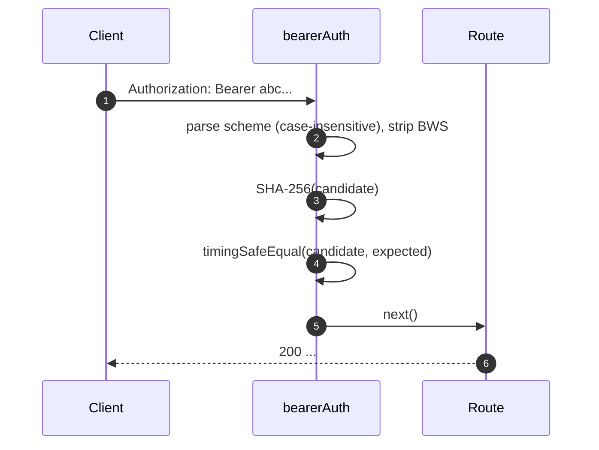
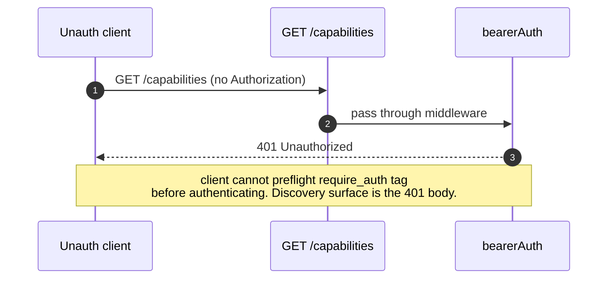
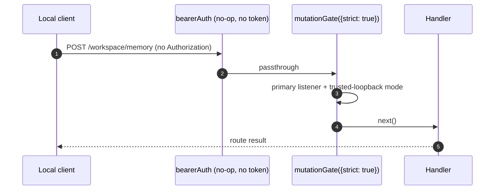

# Auth & Security Model

## Overview

`qwen serve` is a local daemon by default and an exposed surface in the wrong configuration. Its security model is **layered** so that misconfiguration fails closed:

1. **Bind** — a non-loopback bind always carries a bearer: the operator's, or an ephemeral 128-bit one generated and printed once at startup. Boot refuses only when a supplied token source is explicitly empty/whitespace, or when a requested `localhost` resolves off-loopback with no token source resolved (which never generates).
2. **Bearer auth** — `bearerAuth` middleware with constant-time SHA-256 compare protects normal API routes except `/health` on an ordinary loopback bind (`require_auth` moves that endpoint behind the bearer too). Channel webhook ingress is a separate pre-bearer route authenticated by `x-qwen-webhook-secret`. Web Shell document and asset routes remain pre-auth in every mode.
3. **Host header allowlist** — on loopback, only `localhost`, `127.0.0.1`, `[::1]`, `host.docker.internal`, or the exact bound loopback address (plus port) are accepted; the corresponding port-less forms are also accepted when listening on 80 or 443. The allowlist defends against DNS rebinding. The Local Control LAN listener is the exception that always enforces its advertised-authority Host check, whatever the primary bind is.
4. **Origin control** — the runtime app always installs `allowOriginCors` over a mutable allowlist (`MutableOriginAllowlist`): the `--allow-origin <pattern>` entries seed it, and Local Control adds the LAN origin while enabled. Non-matching origins receive the 403 deny envelope. The unconditional deny wall (`denyBrowserOriginCors`) survives only in the bootstrap app that answers before the runtime starts.
5. **Per-route mutation gate** — strict routes require operator authority. A token-less loopback primary listener is trusted; bearer-authenticated and paired Local Control requests also qualify. A token-less primary request that reaches this gate without trusted authority receives the distinct `code: 'token_required'` error. Missing or invalid configured credentials and unpaired Local Control credentials are rejected earlier by their listener-scoped bearer middleware with plain `401 Unauthorized`.
6. **Device-flow auth** — separate OAuth surface for providers (`POST /workspace/auth/device-flow` + GET/DELETE on `/:id`).

This doc walks through each layer and the explicit invariants the boot path enforces.

## Responsibilities

- Refuse to boot in unsafe configurations.
- Gate normal API requests through bearer when configured, subject to the loopback `/health` exemption; keep channel webhook ingress behind its independent shared-secret gate, and keep loopback Host and browser Origin checks in front of authenticated and exempt routes.
- Provide a per-route mutation gate Wave 4 routes opt into.
- Host the device-flow registry that drives provider OAuth flows visible via SSE events.

## Architecture

### Boot-time refuse rules

In `run-qwen-serve.ts`:

```ts
// A non-loopback bind with neither --token nor QWEN_SERVER_TOKEN first
// generates an ephemeral 128-bit base64url bearer (16 random bytes, 22
// URL-safe characters; printed once at startup, rotated per process). The
// first refusal below therefore fires only when a token source was supplied
// but is explicitly empty/whitespace, or when the requested hostname resolves
// off-loopback (localhost pinned to a non-loopback address never generates).
// Generation is loopback-suppressed, so the second refusal is a loopback-only
// fail-fast: on a non-loopback bind the generated token already satisfies
// --require-auth.
if (!isLoopbackBind(opts.hostname) && !token) {
  throw new Error('Refusing to bind <host>:<port> without a bearer token. ...');
}
if (opts.requireAuth && !token) {
  throw new Error(
    'Refusing to start with --require-auth set but no bearer token configured. ...',
  );
}
```

Tokenless allow-origin configuration is limited to loopback HTTP(S) origins;
non-HTTP(S) entries retain their existing handling:

```ts
const parsed = parseAllowOriginPatterns(opts.allowOrigins);
if (parsed.allowAny && !token) {
  throw new Error(
    "Refusing to start with --allow-origin '*' but no bearer token configured. ...",
  );
}
if (findNonLoopbackHttpOrigin(parsed) && !token) {
  throw new Error(
    'Refusing to start with a non-loopback HTTP(S) --allow-origin but no bearer token configured. ...',
  );
}
```

These refusals are explicit boot failures (visible in stderr / thrown to the embedder),
never silent. The threat model from #3803 explicitly forbids silently letting a
daemon bind beyond loopback in the open.

`runQwenServe()` resolves `localhost` once, pins the listener to that address, and verifies the actual listener address before publishing trusted-loopback authority; if the result is outside `127.0.0.0/8` or `::1`, token-less startup fails and closes the listener. `createServeApp()` does not own a socket, so its caller remains responsible for ensuring that a declared loopback hostname is bound only to loopback. A declared non-loopback embed keeps strict routes, session shell, and Local Control pairing material fail closed. It also rejects `requireAuth: true` without a non-empty token at construction so non-strict routes cannot accidentally remain open under an invalid hardened configuration.

### Middleware chain (HTTP request order)

```mermaid
flowchart LR
    REQ[Request] --> LS["loopback self-origin strip<br/>(server/self-origin.ts)"]
    LS --> LOG["access-log middleware<br/>(DaemonLogger)"]
    LOG --> TID["inbound trace-id capture"]
    TID --> HA["hostAllowlist<br/>(loopback DNS-rebinding defense;<br/>primary gate passes through on<br/>non-loopback binds, Local Control<br/>keeps its own Host gate)"]
    HA --> SO["remote same-origin check<br/>(credential check + Origin strip)"]
    SO --> AO["allowOriginCors<br/>(mutable allowlist: --allow-origin<br/>patterns + Local Control LAN origin)"]
    AO --> H["pre-auth /health<br/>(loopback, unless --require-auth)"]
    H --> WH{"Channel webhook?"}
    WH -->|yes| WS["x-qwen-webhook-secret<br/>+ webhook rate/body limits"]
    WH -->|no| BA["bearerAuth"]
    BA --> RL["rate-limit middleware<br/>(when enabled)"]
    RL --> JSON["express.json<br/>(body parser)"]
    JSON --> TEL["daemonTelemetryMiddleware<br/>(OTel span)"]
    TEL --> MG["per-route: mutationGate<br/>(opt-in strict)"]
    MG --> HANDLER["route handler"]
```



`mutationGate` is a per-route middleware factory (`createMutationGate` returns
`mutate()`); routes call `mutate()` or `mutate({strict: true})` at registration
time. It is not a global `app.use()` middleware. Access logging and inbound
trace-id capture are registered ahead of the origin wall and the same-origin
credential check, so those 403/401 short-circuits are logged like every other
reject and the log line still joins the caller's trace id; both also precede
`bearerAuth`, so 401 rejects are still logged. The loopback Host allowlist is registered ahead of the pre-auth health
route so the DNS-rebinding defense covers it. Pre-auth `/health` sits below
the origin wall (matched cross-origin probes carry CORS headers); the access
log exempts `GET /health` and `POST */heartbeat` by path before attaching its
finish logger, so exact-path `GET /health` and `POST */heartbeat` probes stay
unlogged at any mount position and wall rejects on those exempt paths are
likewise unlogged (`HEAD /health` and `GET /health/` are logged like any
request). Normal API rate limiting
runs after `bearerAuth` and before `express.json()`, so only authenticated
requests count and large bodies are rejected before parsing when a limit is
exceeded. Channel webhook ingress branches before bearer auth and applies its
own shared-secret check, mutation-tier rate check, and 1 MiB parser.

The same-origin surface is two middlewares in `server/self-origin.ts`, mounted
apart: the loopback-only `Origin` strip installs ahead of the access log (it
only deletes a matching `Origin`, never rejects), and
`installRemoteSelfOriginMiddleware` runs immediately before
`allowOriginCors` on a non-loopback primary listener with a configured token.
The remote one matches a canonical `Origin` against the direct socket scheme
plus the normalized `Host` authority — forwarded headers are never consulted —
and bearer-authenticates the match before deleting `Origin`, so the built-in Web
Shell's same-origin HTTP mutations need no `--allow-origin`. Its pre-auth
predicate (`web-shell-preauth.ts`) exempts the shell entry points (`/`, `//`,
`/assets*`, `/manifest.webmanifest`, `/sw.js`, `/mcp-app-sandbox`, exact
`/session/:id`, `/plugins`, `/channels`, `/live`, `/scheduled-tasks`, `/goals`, and `/settings` document navigations) from
the credential check because browser module-script fetches carry `Origin`
without `Authorization`. WebSocket upgrades and TLS-front-proxy `https` origins
are not covered: the upgrade gate keeps its own CSWSH policy (loopback origin,
`--allow-origin` entry, or the Local Control listener's own origin), and a
proxy's `https` origin can never match the plain socket's scheme.

### `bearerAuth`

- **No token configured** → middleware is a no-op (loopback developer default). Exception: the Local Control **LAN listener** is listener-scoped and always requires its pairing credential (`CredentialStore.isOpen` is never true for `local-control`), so it is never open even on a token-less daemon.
- **Token configured** → SHA-256 the configured token once at construction; on every request hash the candidate and `timingSafeEqual` compare. No string-equality short-circuit; no time-leak.
- **Scheme parsing**: case-insensitive `Bearer` per RFC 7235 §2.1; tolerant of `SP\tHTAB` between scheme and credentials per RFC 7230 §3.2.6 BWS; rejects pure-HTAB-as-separator.
- **CodeQL hardening**: hand-rolled `indexOf` parsing rather than regex with `\s+` / `.+` overlap (no polynomial-regex risk).

### `hostAllowlist`

Loopback-only. Maintains a `Set<string>` keyed by port. Allowed Hosts:

- `localhost:<port>`, `127.0.0.1:<port>`, `[::1]:<port>`, `host.docker.internal:<port>`, and the exact bound loopback address with the same port. The last form covers the complete supported IPv4 loopback range (`127.0.0.0/8`) without admitting unrelated Hosts.
- Plus the corresponding no-port forms **only** when bound to port 80 or 443 (per RFC 7230 §5.4 default-port omission).

Host comparison is **case-insensitive** — Express normalizes header names but not values, so Docker proxies that capitalize Hosts (`Localhost:4170`, `HOST.docker.internal`) would 403 with an exact-string compare.

Non-loopback binds bypass the primary gate (operator chose the surface area; bearer token gates Host spoofing instead). The Local Control LAN listener is the exception: it always enforces its advertised-authority Host check, whatever the primary bind is.

### `denyBrowserOriginCors` (bootstrap app only)

Reject any request with an `Origin` header. CLI/SDK never set Origin; only browsers do. Returns deterministic `403 { error: 'Request denied by CORS policy' }` rather than the 500 HTML the `cors` package's error-callback would produce. The runtime app no longer installs this wall — it runs `allowOriginCors` over the mutable allowlist (below); the deny behavior survives there as the unmatched-origin branch. The wall remains in the bootstrap app (run-qwen-serve.ts) that serves requests before the runtime starts.

Exception: the Web Shell's same-origin XHRs on a **loopback** bind are handled by a separate middleware (in `server/self-origin.ts`) that strips `Origin` when it matches one of the canonical loopback self-origins (`127.0.0.1`, `localhost`, `[::1]`, `host.docker.internal`) or the exact bound loopback address. Scheme-matched port-less origins are accepted only for their default port (`http` on 80, `https` on 443). On non-loopback binds a second middleware (`installRemoteSelfOriginMiddleware`, in the same file) covers the shell's XHRs instead: it bearer-authenticates a request whose canonical `Origin` equals the direct socket scheme plus the normalized `Host` authority — forwarded headers are never trusted — and strips that `Origin` before the wall, so those requests need no `--allow-origin` entry. Cross-origin and `null` origins remain rejected, and the WebSocket upgrade routes plus a TLS-front-proxy `https` origin still require one (see [Middleware chain](#middleware-chain-http-request-order)).

### `allowOriginCors` (runtime app, always installed)

The runtime app installs `allowOriginCors(originAllowlist)` unconditionally;
the allowlist is a `MutableOriginAllowlist` seeded from the `--allow-origin
<pattern>` entries (possibly none) and extended at runtime while Local
Control is enabled (the LAN origin is added/removed with the listener):

- Matching `Origin` values receive `Access-Control-Allow-Origin`,
  `Access-Control-Allow-Headers`, and `Access-Control-Allow-Methods`; `OPTIONS`
  preflight returns `204`.
- Non-matching `Origin` values receive the same deterministic
  `403 { error: 'Request denied by CORS policy' }` as deny mode.
- `--allow-origin '*'` requires a bearer token; on loopback binds boot refuses when none is configured, while on non-loopback binds the generated ephemeral token satisfies the guard (the refusal is loopback-only).
- Without a token, HTTP(S) `--allow-origin` values are limited to loopback hosts on loopback binds; on non-loopback binds the generated token satisfies the same guard. A non-loopback browser origin authenticates with the bearer on every API route because it could otherwise exercise the full operator API, including code execution as the daemon user; the pre-auth exceptions are the Web Shell document/asset routes and the MCP App sandbox (`/`, `/assets*`, `/manifest.webmanifest`, `/sw.js`, `/mcp-app-sandbox`, exact `/session/:id` navigations), plus the channel webhook ingress, which branches ahead of `bearerAuth` and authenticates with its own `x-qwen-webhook-secret` instead of the bearer, and — on loopback binds only — `/health` (bearer-gated elsewhere).
- Explicit browser-extension origins retain their tokenless local-automation path. Startup logs that any tokenless allowed browser origin receives full operator authority.
- `parseAllowOriginPatterns()` validates pattern syntax at boot.
- The `allow_origin` capability tag is advertised only when this mode is
  configured.

### `createMutationGate`

Per-route opt-in gate. Behavior matrix:

| daemon/request authority                                      | route opts      | result                           |
| ------------------------------------------------------------- | --------------- | -------------------------------- |
| token configured                                              | any             | passthrough¹                     |
| trusted-loopback primary listener                             | any             | passthrough                      |
| paired Local Control listener                                 | `strict: true`  | passthrough                      |
| token-less primary request without trusted-loopback authority | `strict: true`  | `401 { code: 'token_required' }` |
| any token-less deployment                                     | `strict: false` | passthrough                      |

¹ Any token configuration makes global `bearerAuth` enforce bearer auth before the gate on normal API routes, except loopback `/health` unless `--require-auth` is set. Channel webhook ingress authenticates with its own shared secret before this middleware. The gate is redundant but harmless on routes it protects. `--require-auth` is not itself authentication and is valid only with a token.

Trusted-loopback mode is derived once from `loopback bind && no configured token && !requireAuth`. It authorizes only requests arriving through the primary listener. It does not stamp the internal bearer-authenticated marker, so listener credentials and deployment authority remain distinct facts. The `code: 'token_required'` shape remains for older daemons and token-less non-trusted embeds whose requests reach the strict gate, so SDK clients can render a configuration hint instead of a generic 401. Configured-token and Local Control credential failures retain the earlier plain `401 Unauthorized` response.

Local Control status and enable responses expose their pairing URL and QR only to callers with operator authority: trusted primary-listener callers, bearer-authenticated primary callers, and already paired LAN clients. Unpaired LAN callers and non-trusted embeds cannot retrieve it. Enabling still requires the primary listener; LAN clients may access after pairing or request disable under the existing rules.

**Wave 4+ strict routes**: `/workspace/memory`, `/workspace/agents/*`,
`/workspace/agents/generate`, `/file/write`, `/file/edit`,
`/workspace/tools/:name/enable`, `/workspace/mcp/:server/restart`,
`/workspace/mcp/:server/{enable,disable,authenticate,clear-auth}`,
`/workspace/mcp/servers` (POST/DELETE), `/workspace/auth/device-flow`,
`/workspace/init`, `/session/:id/approval-mode`, `/session/:id/rewind`, and
`/session/:id/shell`.

Rewind remains REST-only in the TypeScript SDK even when an ACP transport is
configured. This preserves the strict mutation gate and bearer/client identity
headers; the ACP route table intentionally has no rewind mapping. Owner routing
also rechecks workspace trust before either rewind or shell reaches a secondary
runtime bridge. Duplicate live session ids fail closed as
`ambiguous_session_owner` instead of falling back to the primary runtime.

### `/health` exemption

On loopback binds, `/health` is registered **before** the bearer middleware so liveness probes inside the pod do not need to carry the token. Non-loopback binds gate `/health` with the other normal API routes. `--require-auth` drops the exemption: `/health` requires `Authorization: Bearer <token>` on loopback too. Channel webhook ingress remains outside bearer auth in every mode and requires its own `x-qwen-webhook-secret`.

### v1 client identity (`X-Qwen-Client-Id`) is self-reported

The daemon validates only the format of `X-Qwen-Client-Id`
(`[A-Za-z0-9._:-]{1,128}`) and tracks attached client ids per session. It does
not currently perform proof-of-possession. A client that observes
`originatorClientId` on SSE can re-register the same id and impersonate that
originator in later requests.

Impact:

- `designated` — a remote caller can impersonate the originator and vote on a
  request intended only for the prompt originator.
- `consensus` — if the spoofed id was already in the `votersAtIssue` snapshot,
  it can vote.
- `local-only` is not affected because it gates on `fromLoopback`, which the
  daemon stamps from the connection remote address.
- `first-responder` is not affected because it is identity-agnostic.

A future pair-token mechanism will issue a per-session secret from
`POST /session`; `designated` / `consensus` votes will have to present it. Until
then, deployments that need a hardened designated policy should bind loopback
or run behind an authenticated reverse proxy. See
[`04-permission-mediation.md`](./04-permission-mediation.md) for policy-level
details.

### Device-flow auth

Separate OAuth surface for provider authentication. The v1 provider identifier is
`qwen-oauth`, but Qwen OAuth free tier was discontinued on 2026-04-15; new
setups should use a currently supported auth provider when one is available.

- `POST /workspace/auth/device-flow` — start a flow; returns `{deviceFlowId, providerId, expiresAt, verificationUrl, userCode}`.
- `GET /workspace/auth/device-flow/:id` — poll state.
- `DELETE /workspace/auth/device-flow/:id` — cancel.
- `GET /workspace/auth/status` — current account / provider snapshot.

SSE events `auth_device_flow_{started, throttled, authorized, failed, cancelled}` fan-out flow state to all subscribers so multi-client UIs stay in sync. See [`09-event-schema.md`](./09-event-schema.md).

Implementation: `packages/cli/src/serve/auth/device-flow.ts` + `qwen-device-flow-provider.ts`.

**Log injection / Trojan Source defense**: `sanitizeForStderr(value)`
(`device-flow.ts`) replaces ASCII control characters and Unicode control
characters with `?`. A malicious IdP could otherwise forge log lines or hide
payloads:

| Range                            | Why it is stripped                                                                                                                                                                                                                                                  |
| -------------------------------- | ------------------------------------------------------------------------------------------------------------------------------------------------------------------------------------------------------------------------------------------------------------------- |
| `\x00–\x1f`, `\x7f`, `\x80–\x9f` | ASCII C0 / DEL / C1 controls, terminal escapes, and log-line forging.                                                                                                                                                                                               |
| U+200B-U+200F                    | Zero-width characters plus LRM / RLM; invisible but can change terminal rendering.                                                                                                                                                                                  |
| U+2028-U+2029                    | LINE / PARAGRAPH SEPARATOR; many Unicode-aware terminals treat them as line breaks.                                                                                                                                                                                 |
| U+202A-U+202E                    | Bidirectional EMBEDDING / OVERRIDE controls.                                                                                                                                                                                                                        |
| U+2066-U+2069                    | Bidirectional ISOLATE controls (LRI / RLI / FSI / PDI), the main [CVE-2021-42574 "Trojan Source"](https://trojansource.codes/) vector. An IdP using U+2066 (LRI) instead of U+202D (LRO) can bypass EMBEDDING/OVERRIDE-only filters with similar visual reordering. |
| U+FEFF                           | BOM / zero-width no-break space.                                                                                                                                                                                                                                    |

Length is preserved by replacing each stripped code point with `?` rather than
deleting it, so operators can still see that something was present at that
index. Both layers use the sanitizer: `qwenDeviceFlowProvider` sanitizes IdP
`oauthError`, and the registry's late-poll observer sanitizes provider-controlled
values interpolated into audit hints (`latePollResult.kind` / `lateErr.name`).

The `auth_device_flow` capability tag is advertised **unconditionally**; the routes themselves return `400 unsupported_provider` if the daemon cannot satisfy a specific provider. The supported-providers list is on `/workspace/auth/status` rather than `/capabilities` to keep the descriptor shape uniform.

## Workflow

### Bearer auth successful request



### Bearer auth failure modes

All return `401 { error: 'Unauthorized' }` (uniform across `missing header` / `wrong scheme` / `wrong token` so probing cannot distinguish).

### `--require-auth` shadow



After authenticating, `caps.features.includes('require_auth')` confirms the deployment is hardened.

### Strict mutation on trusted loopback



## State & Lifecycle

- Bearer token is read at boot and trimmed (newlines from `cat token.txt` would otherwise silently break comparison).
- The CLI-only `--open-with-auth` mode runs before boot: after deterministic loopback/Web Shell checks, it applies the same option-over-environment selection and fills `ServeOptions.token` with 32 random bytes encoded as base64url only when no non-empty selected token exists. The generated credential has process lifetime, is not written to `process.env` or persisted by the daemon, and reaches the browser through the existing URL fragment. The Web Shell retains its browser copy in per-tab `sessionStorage`. Bare `--open` and direct `runQwenServe()` callers never generate it.
- Allowed-Host Set is cached per port; rebuilt on port change (ephemeral `0` → real port post-`listen`).
- Mutation gate constructs `passthrough` and `strictDenier` once per app build; per-route call returns the cached closure (no per-request allocation).
- Device-flow registry is disposed on `shutdown()` Phase 1 so pending flows resolve as `cancelled` before HTTP teardown.

## Dependencies

- `node:crypto` — `createHash`, `timingSafeEqual`.
- `packages/cli/src/serve/loopback-binds.ts` — `isLoopbackBind`.
- `packages/cli/src/serve/auth/device-flow.ts` — device-flow state machine.
- `@qwen-code/acp-bridge` — surfaces device-flow events on the per-session SSE bus.

## Configuration

| Source          | Knob                                                                                    | Effect                                                                                                                                        |
| --------------- | --------------------------------------------------------------------------------------- | --------------------------------------------------------------------------------------------------------------------------------------------- |
| Env             | `QWEN_SERVER_TOKEN`                                                                     | Bearer token (trimmed).                                                                                                                       |
| Flag            | `--token`                                                                               | Bearer token (overrides env).                                                                                                                 |
| CLI flags       | `--open-with-auth`                                                                      | Reuse or generate a loopback Web Shell bearer before daemon boot.                                                                             |
| Flag            | `--require-auth`                                                                        | Extends bearer to loopback + `/health`. Boots only with a token.                                                                              |
| Flag            | `--hostname`                                                                            | Non-loopback bind always carries a bearer — `--token`, `QWEN_SERVER_TOKEN`, or a generated ephemeral one; an explicitly empty source refuses. |
| Flag            | `--allow-origin <pattern>`                                                              | Switch to CORS allowlist mode. Wildcard and non-loopback HTTP(S) origins require a token.                                                     |
| Capability tags | `require_auth` (conditional), `auth_device_flow` (always), `allow_origin` (conditional) | See [`11-capabilities-versioning.md`](./11-capabilities-versioning.md).                                                                       |

## Caveats & Known Limits

- **`--require-auth` shadows feature preflight.** Unauthenticated clients cannot discover the `require_auth` tag; their discovery surface is the 401 body itself.
- **Mutation gate body-parser ordering**: `mutationGate({strict: true})` 401 responses fire **after** `express.json()` parses the body. Worst case on a saturated listener: `--max-connections × express.json({limit: '10mb'})` ≈ 2.5 GB transient. Non-loopback production entrypoints already require bearer auth before the normal API parser; channel webhook ingress instead checks its shared secret before its separate 1 MiB parser. Direct non-trusted embeds own their listener exposure.
- **Same-origin Origin stripping** in `server.ts` happens _before_ `allowOriginCors`. If a future change moves the strip elsewhere, the Web Shell breaks.
- **Token comparison is over the SHA-256 digest**, not the raw token. Reduces timing leakage by collapsing variable-length token compares to a fixed-size digest compare.
- The daemon does **not** carry mTLS, request signing, or pair-token proof-of-possession today. `--rate-limit` provides HTTP rate limiting by client-id / IP key; it is not client identity authentication.

## References

- `packages/cli/src/serve/auth.ts` (entire file)
- `packages/cli/src/serve/run-qwen-serve.ts` (refuse rules)
- `packages/cli/src/serve/loopback-binds.ts`
- `packages/cli/src/serve/auth/device-flow.ts`
- `packages/cli/src/serve/auth/qwen-device-flow-provider.ts`
- User-facing threat model: [`../../users/qwen-serve.md`](../../users/qwen-serve.md).
- Wire reference: [`../qwen-serve-protocol.md`](../qwen-serve-protocol.md).
